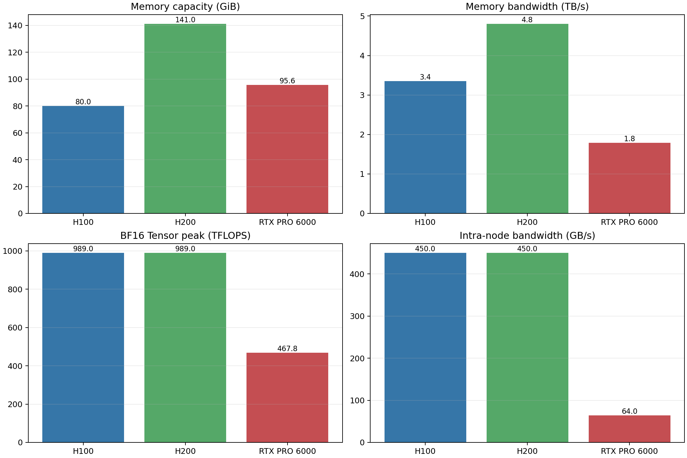
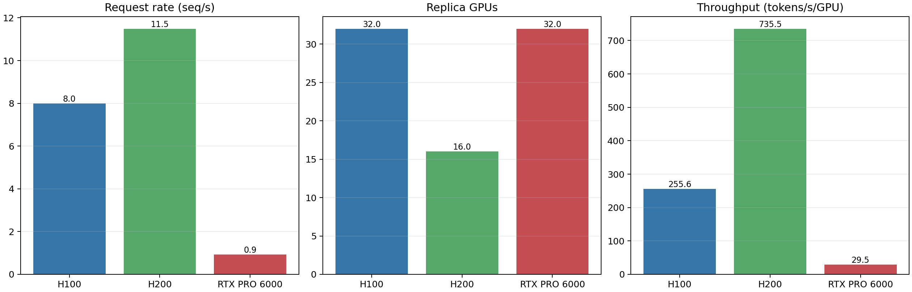
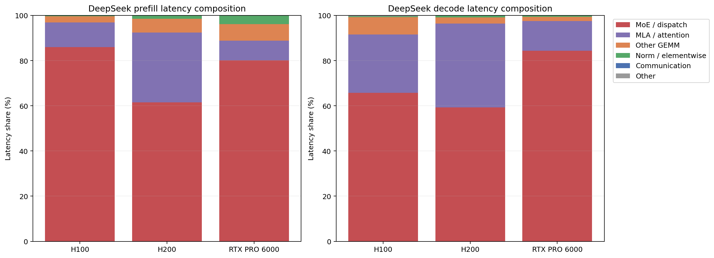

# H100、H200 与 RTX PRO 6000 Pareto 差异深度分析

## 1. 结论摘要

本轮现象不能只用“单卡峰值算力”解释。Pareto 结果同时受四层因素控制：单算子服务时间、可容纳的 batch、模型副本所需 GPU 数、PD 两侧速率匹配。最终指标为：

\[
T_{gpu}=\frac{R_{request}\times OSL}{G_{replica}}
\]

其中 `OSL=1024`，`R_request=min(C_p,C_d)`，而 `G_replica` 是一套 prefill 与 decode worker 合计占用的 GPU 数。

核心结论如下。

1. H200 与 H100 的 DeepSeek 最高吞吐差 `2.878x`，不是 2.878 倍的芯片计算速度。它可精确分解为请求率 `1.439x` 与每副本 GPU 数减半 `2x` 的乘积。前者接近 HBM 带宽比 `4.8/3.35=1.433x`；后者来自 141 GiB HBM 允许 EP8，而 80 GiB H100 需要 EP16。
2. 这个巨大倍数是 DeepSeek 大模型触发显存容量台阶后的结果。Llama 70B 和 Qwen3 32B 的 H200/H100 最高吞吐比分别只有 `1.448x` 和 `1.473x`，与带宽代际收益相符。
3. RTX PRO 6000 的 DeepSeek 最优点为 `29.499 tokens/s/GPU`，由 decode 限制：`0.334 seq/s/worker x 3 workers x 0.92 = 0.922 seq/s`。逐算子回放显示 decode 时延的 `84.4%` 位于 MoE routed/shared overlap，`13.2%` 位于 MLA，普通 GEMM 仅约 `1.9%`。
4. PRO6000 的硬伤是“容量迫使 TP8 + 每节点仅 2 卡且无 NVLink + 61 层 MoE 反复 collective + 较小 decode batch”的组合，而不是某一个孤立参数。TP8 横跨 4 个节点，MoE pre/post dispatch 在当前 SGLang 非 DeepEP 路径中进入 custom all-reduce；50 GB/s 跨节点链路与 H100/H200 450 GB/s NVLink 域有数量级差距。
5. 当前 H100 ANALYTICAL 使用 WideEP，H200 和 PRO6000 使用普通 MoE。这是实验配置中的混杂因素，不能把路径差异伪装成硬件差异。尽管如此，吞吐公式、内存可行配置和逐算子瓶颈均直接来自已保存结果，容量台阶和 PRO6000 decode-MoE 瓶颈结论不依赖这一混杂因素。

## 2. 硬件差异并不只在算力

| 资源 | H100 SXM | H200 SXM | RTX PRO 6000 Server | 解释 |
| --- | ---: | ---: | ---: | --- |
| 显存容量 | 80 GiB | 141 GiB | 95.6 GiB | 决定能否使用更小 EP/TP 和更大 batch |
| 显存带宽 | 3.35 TB/s | 4.80 TB/s | 1.792 TB/s | H200/H100=`1.433x`；PRO6000/H100=`0.535x` |
| BF16 Tensor 峰值 | 989 TFLOPS | 989 TFLOPS | 467.8 TFLOPS | H100/H200 完全相同；PRO6000 约为 47% |
| FP8 Tensor 峰值 | 1978 TFLOPS | 1978 TFLOPS | 935.6 TFLOPS | 仍不能单独解释 DeepSeek 吞吐差 |
| 每节点 GPU | 8 | 8 | 2 | 决定 TP8 是否留在一个高速互联域内 |
| 节内单向带宽 | 450 GB/s | 450 GB/s | 64 GB/s PCIe | PRO6000 没有 NVLink |
| 跨节点单向带宽 | 50 GB/s | 50 GB/s | 50 GB/s 占位配置 | PRO6000 TP8 必然跨 4 节点 |



对 H100/H200，算力峰值相同意味着 compute-bound GEMM 不应凭空产生数倍差距。真正变化的是 HBM 带宽和容量。容量还不是连续变量：一旦跨过“模型能以 EP8 放下”的阈值，副本 GPU 数会离散地减半，随后直接作用于 `tokens/s/GPU` 的分母。

## 3. H100 与 H200：2.878 倍是怎样形成的

### 3.1 最优点的直接分解

| 指标 | H100 | H200 | H200/H100 |
| --- | ---: | ---: | ---: |
| 最高吞吐 | 255.571 | 735.494 tokens/s/GPU | 2.878x |
| 最终 request rate | 7.987 | 11.492 seq/s | 1.439x |
| 每副本 GPU 数 | 32 | 16 | H200 分母减半 |
| Prefill worker | `tp1 dp16 ep16` | `tp1 dp8 ep8` | 16 GPU 对 8 GPU |
| Decode worker | `tp1 dp16 ep16` | `tp1 dp8 ep8` | 16 GPU 对 8 GPU |
| Prefill/Decode worker 数 | 1/1 | 1/1 | 相同 |
| Prefill 显存 | 67.8 GiB/GPU | 108.9 GiB/GPU | 均可放入各自硬件 |
| Decode 显存 | 68.9 GiB/GPU | 124.0 GiB/GPU | H200 利用额外容量 |

代入结果：

\[
\frac{T_{H200}}{T_{H100}}
=\frac{11.492}{7.987}\times\frac{32}{16}
=1.439\times2
=2.878
\]



因此，约一半的对数尺度收益来自更快的服务率，另一半来自副本打包效率。若只比较 Tensor Core TFLOPS，会完全漏掉后者。

### 3.2 为什么 request rate 又接近 HBM 带宽比

当前两个最优点均由 prefill 侧限速：

- H100：`Cp=8.874 x 1 x 0.9=7.987 seq/s`；decode 容量为 `11.621 x 1 x 0.92=10.691 seq/s`。
- H200：`Cp=12.769 x 1 x 0.9=11.492 seq/s`；decode 容量为 `13.497 x 1 x 0.92=12.417 seq/s`。

Prefill worker 服务率比 `12.769/8.874=1.439x`，几乎等于 HBM 带宽比 `1.433x`。这说明当前获胜配置的边际收益主要来自内存系统，而不是相同的 Tensor Core 峰值。

这并不意味着所有 prefill 算子都严格 memory-bound。逐算子回放中 MoE 占主导，且配置、batch 和执行路径同时变化；这里能成立的是系统级相关性，而不是“每个 kernel 都按 1/BW 缩放”的强断言。

### 3.3 是否只是最高吞吐点牺牲了用户速度

H100 最高吞吐点为 `28.578 tokens/s/user`，H200 最高吞吐点为 `25.381 tokens/s/user`，两者确实不在完全相同的用户时延位置。使用 H200 前沿上最接近 H100 用户速率的点比较：

- H100：`28.578 tokens/s/user, 255.571 tokens/s/GPU`。
- H200：`29.369 tokens/s/user, 649.093 tokens/s/GPU`。

同等用户生成速率附近仍有 `2.54x` 吞吐差，因而现象不是单纯由 Pareto 端点选择造成的。

### 3.4 DeepSeek 为什么特殊

同一批 ANALYTICAL-standard 结果中：

| 模型 | H100 最高吞吐 | H200 最高吞吐 | 比值 |
| --- | ---: | ---: | ---: |
| Llama 3.1 70B | 291.338 | 421.747 | 1.448x |
| Qwen3 32B | 564.768 | 831.709 | 1.473x |
| DeepSeek V3 | 255.571 | 735.494 | 2.878x |

前两个 dense 模型没有触发同样强烈的副本 GPU 数台阶，所以表现为约 `1.45x` 的常规带宽收益。DeepSeek 671B 级参数、MLA 和 61 层 MoE 权重布局使显存容量直接改变 EP 粒度，最终放大为倍数级系统吞吐差。

## 4. RTX PRO 6000：为什么 DeepSeek 低于 30

### 4.1 先从速率匹配定位到 decode

PRO6000 最优配置为：

- P/D 均为 `tp8 pp1 dp1 moe_tp1 ep8`，每个 worker 占 8 GPU。
- Prefill 使用 1 个 worker，`1.665 seq/s/worker`，降级后 `Cp=1.499 seq/s`。
- Decode 使用 3 个 worker，每个仅 `0.334 seq/s`，降级后 `Cd=0.334 x 3 x 0.92=0.922 seq/s`。
- 最终 `R=min(1.499,0.922)=0.922 seq/s`，明确由 decode 限制。
- `T=0.922 x 1024 / 32=29.5 tokens/s/GPU`。

这说明继续增加 prefill 能力没有用；需要降低 decode worker 的每步时延，或降低单个 decode worker 占用的 GPU 数。

### 4.2 逐算子结果：MoE 是第一瓶颈，MLA 是第二瓶颈

代表性最优 worker 的 ANALYTICAL-standard 静态回放结果如下。decode 回放为完整 1023 个输出步的累计值。

| 系统 | MoE/dispatch | MLA/attention | 其他 GEMM | norm/elementwise | 主要判断 |
| --- | ---: | ---: | ---: | ---: | --- |
| H100 decode | 65.7% | 25.9% | 7.7% | 0.4% | WideEP 路径，不能与普通路径逐项硬比 |
| H200 decode | 59.3% | 37.2% | 2.6% | 0.9% | 普通 MoE，batch=68 |
| PRO6000 decode | **84.4%** | **13.2%** | 1.9% | 0.6% | 明确由 MoE routed/shared 路径主导 |

PRO6000 的累计回放中：

- `generation_moe_overlap = 42096.1 ms`，约 `41.15 ms/step`。
- `generation_mla_module_or_analytical = 6562.3 ms`，约 `6.41 ms/step`。
- `generation_downscale_gemm = 815.9 ms`，约 `0.80 ms/step`。
- 全部回放约 `48.77 ms/step`；Pareto 表 TPOT 为 `52.668 ms`。



`generation_moe_overlap` 不是“纯专家 GEMM”。代码把 routed 路径（router GEMM、pre-dispatch、MoE compute、post-dispatch）与 shared expert 路径放在两个流中，时延取两组和的最大值。因此该项同时封装了专家计算和通信，图中没有独立 communication 柱并不表示没有通信。

### 4.3 TP8 与双卡节点为什么形成结构性劣势

PRO6000 只有约 95.6 GiB 显存，普通 DeepSeek 无法像 H200 那样以 TP1/EP8 放置，最终被迫选用 TP8/EP8。此时：

1. 单个 worker 占 8 GPU，但每节点只有 2 GPU，因此一个 TP8 worker 横跨 4 节点。
2. SGLang 非 DeepEP 的 `MoEDispatch` 计算 `attention_tp_size=moe_tp*moe_ep/attention_dp=8`，pre/post dispatch 都走 custom all-reduce。
3. 这类 collective 位于每个 MoE 层的 routed 路径中。DeepSeek V3 有 61 个 MoE 层，decode 每生成一个 token 都重复执行，固定通信启动成本和跨节点带宽代价被层数放大。
4. PRO6000 节内也只有 PCIe 64 GB/s，而 H100/H200 的 8 卡域为 450 GB/s NVLink。即使标称 Tensor 算力达到 H100 的约 47%，通信系统并没有达到相同比例。
5. decode 最优 batch 只有 18，而 H200 为 68。较小 batch 更难摊薄 kernel launch、collective latency、专家路由和 split/task 固定成本。

因此，PRO6000 的 29.5 不是“467.8 TFLOPS 应该有多快”的简单缩放问题。它是模型放置造成的并行方式变化，继而把 MoE 通信放到弱拓扑上，再由 decode 的逐 token 执行方式反复放大的结果。

### 4.4 MLA 的作用

MLA 是第二大项，但不是造成低于 30 的首要项。PRO6000 使用 SM120 外推 analytical profile，且 decode MLA 对 KV 读取、task waves、split-KV 和小 batch 固定成本敏感。其 `6.41 ms/step` 已不可忽略，但即使理想地消除整个 MLA 项，MoE 的约 `41 ms/step` 仍会使系统远落后于 H200。

优化优先级应为：

1. 首先避免跨节点 TP8，或采用适配该拓扑的 EP/DeepEP dispatch。
2. 降低 routed MoE pre/post dispatch 与专家计算时延，并验证 overlap 是否真实成立。
3. 再优化/校准 SM120 MLA decode。
4. 普通 GEMM 不是本轮首要目标。

## 5. 回放口径与局限性

逐算子回放使用最优 Pareto 行中的实际 batch 与并行参数，保持 `ISL=4096, OSL=1024`。回放与 Pareto 表的比值为：

| 系统 | Prefill 回放/Pareto | Decode 回放/Pareto |
| --- | ---: | ---: |
| H100 | 0.505 | 0.926 |
| H200 | 0.505 | 0.926 |
| PRO6000 | 0.505 | 0.926 |

相同比例说明差异主要来自 Pareto 流程的 phase latency correction/调度修正，而不是某张卡特有的回放错误。报告使用回放的组成比例定位瓶颈，不用其绝对值替换 Pareto 一手结果。

仍需注意以下限制：

- H100 开启 WideEP，H200/PRO6000 未开启；H100 与 H200 的逐 op 名称及实现边界不同。后续若要做严格硬件 A/B，应固定相同普通 MoE 路径后重跑 H100/H200。
- ANALYTICAL 通信配置为 `empirical` 理论估算，并非真实多节点 PRO6000 集群测量。配置中的 50 GB/s 是保守占位值，结论能说明拓扑敏感性，不能当作该集群的精确 NCCL 预测。
- PRO6000 的 SM120 FA/MLA 与 GEMM 参数含跨架构外推。其绝对吞吐可信度低于 H100/H200，但 MoE 84.4% 的瓶颈方向和 TP8 跨节点事实具有较强结构性。
- `generation_moe_overlap=max(routed,shared)` 假设两路理想并行。若实际资源争用导致 overlap 不完全，PRO6000 的真实时延只会更差，不会推翻 MoE 为主瓶颈的判断。

## 6. 工程建议

对于类似 Pareto 异常，不能只展示最高吞吐，应固定输出四组诊断量：`request_rate`、`num_total_gpus`、P/D 各自容量以及每阶段逐算子占比。尤其要把“更快”和“用更少 GPU 放下一个副本”分开报告。

建议后续验收增加两个控制实验：

1. H100/H200 都关闭 WideEP，以相同普通 MoE、相同 TP/EP 候选空间重跑，隔离纯硬件差异。
2. 对 PRO6000 扫描 2/4/8 GPU 每节点和 50/100/200/450 GB/s 通信带宽，形成吞吐对拓扑的敏感性曲线。若 TP8 通信是根因，MoE 时延和最终吞吐应呈清晰单调响应。

## 7. 可复现产物

- 分析入口：`analyze_hardware_gap.py`
- 硬件资源：`results/hardware_gap_resources.csv`
- 最优配置：`results/hardware_gap_best_points.csv`
- 原始逐算子结果：`results/hardware_gap_operator_breakdown.csv`
- 归并结果：`results/hardware_gap_operator_groups.csv`
- 回放一致性：`results/hardware_gap_replay_validation.csv`
- 图表目录：`figures/hardware_gap/`

运行方式：

```bash
PYTHONPATH=src:src/aiconfigurator/sdk/kernelsim/fa:.self/analytical-mode/pareto-task \
  /home/ai_lab/fjw/miniforge3/envs/ljc01/bin/python \
  .self/analytical-mode/pareto-task/analytical-levels/analyze_hardware_gap.py
```
