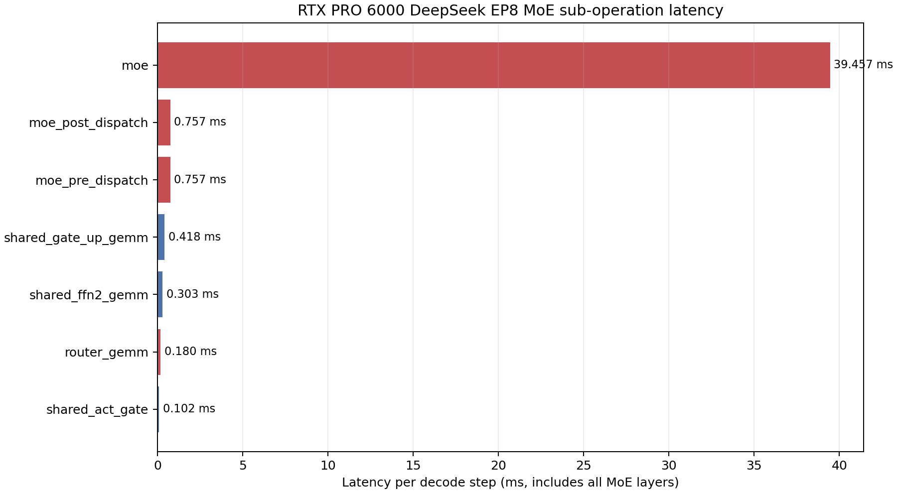
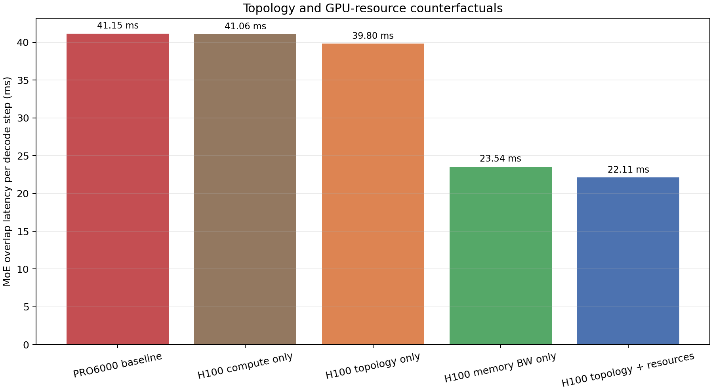

# RTX PRO 6000 DeepSeek MoE EP8 瓶颈细粒度分析

## 1. 直接结论

RTX PRO 6000 上 DeepSeek decode 的 MoE EP8 慢，**首要原因不是 8 卡互联通信，而是每张卡反复从本地显存读取大量活跃专家权重**。

在 Pareto 最优配置 `tp8 pp1 dp1 moe_tp1 ep8`、decode batch 18、DeepSeek MTP 有效 token batch 36 下，单个 decode step 的 MoE overlap 被拆为：

| 子项 | 时延 | routed path 占比 |
| --- | ---: | ---: |
| Router GEMM | 0.180 ms | 0.44% |
| Pre-dispatch | 0.757 ms | 1.84% |
| **Local MoE expert compute** | **39.457 ms** | **95.89%** |
| Post-dispatch | 0.757 ms | 1.84% |
| Routed path 合计 | **41.150 ms** | 100% |
| Shared expert path 合计 | 0.823 ms | 被 routed path 完全覆盖 |

因此：

- 两次通信合计约 `1.513 ms`，只占 routed path 的 `3.68%`。
- 本地 MoE expert 项约 `39.457 ms`，占 `95.89%`。
- Shared expert 只有 `0.823 ms`，由于 `OverlapOp=max(routed, shared)`，不会增加最终关键路径。

这里的 `generation_moe` 虽然在代码中称为 MoE compute，但其模型并非只计算 Tensor Core FLOPs，而是包含 fused routed expert kernel 的启动、计算和本地显存流量。该项慢的实质是 **HBM/GDDR 权重带宽受限**。

## 2. EP8 后每张卡究竟处理什么

DeepSeek V3 的相关参数为：

- hidden size：7168。
- expert intermediate size：2048。
- routed experts：256。
- top-k：8。
- `moe_ep_size=8`，`moe_tp_size=1`。
- FP8 block Triton recipe。

EP8 将 256 个专家均匀分配到 8 张卡，因此每张卡持有：

\[
E_{local}=256/8=32\ experts
\]

有效 token batch 为 36。每个 token 路由到 8 个专家，均匀分布后每张卡收到的 assignment 数为：

\[
A_{local}=36\times8/8=36
\]

模型按均匀路由估计活跃专家数：

\[
E_{active}=min(E_{local},A_{local})=min(32,36)=32
\]

也就是说，**一个 decode step 已足以激活该 GPU 上全部 32 个本地专家**。虽然每个专家实际只接收约一个 token，但其权重仍需被读取。这是小 batch MoE 的典型低算术强度问题：参与计算的 token 很少，激活的专家却很多。

## 3. 为什么是本地权重带宽，而不是 Tensor Core

### 3.1 每层逻辑工作量

当前 Sum-3P MoE 模型对一个 MoE 层给出的主要量为：

| 量 | 数值 |
| --- | ---: |
| FLOPs | 3.171 GFLOPs |
| 总逻辑流量 | 1.413 GB |
| 专家权重 value bytes | **1.409 GB** |
| 权重 scale bytes | 0.344 MB |
| activation quant bytes | 0.666 MB |
| 本地 assignments | 36 |
| 本地/活跃专家 | 32/32 |

超过 `99%` 的逻辑字节来自专家权重。其算术强度仅约：

\[
AI=3.171\ GFLOPs/1.413\ GB\approx2.24\ FLOP/Byte
\]

PRO6000 的 FP8 峰值与显存带宽之比约为：

\[
935.6\ TFLOPS/1.792\ TB/s\approx522\ FLOP/Byte
\]

`2.24 FLOP/Byte` 远低于约 `522 FLOP/Byte` 的硬件平衡点，因此该 kernel 位于极端 memory-bound 区域。

### 3.2 模型内部时延项

标准 FP8-block 参数为 `eta_compute=0.73`、`eta_mem=0.70`、launch `46 us`。对应单层未乘模型层数前的解析结果：

- Compute：约 `4.64 us`。
- Memory：约 `1126.69 us`。
- Launch：`46 us`。
- 合计：约 `1177.33 us`。

模型采用 `launch + compute + memory`，不是基础 Roofline 的 `max(compute,memory)`。即便如此，memory 项仍占 body 的约 `99.6%`，compute 项只有约 `0.4%`。

DeepSeek 的大量 MoE 层在每个 decode step 中重复执行该过程，最终累积为约 `39.46 ms` 的 `generation_moe`。所以问题不是“PRO6000 Tensor Core 只有 H100 的一半”，而是“每生成一步都需要从较慢的本地 GDDR7 流式读取大量离散专家权重”。

需要特别说明当前 AIC 实现口径：`DeepSeekModel` 使用 `num_hidden_layers=61` 作为 MoE operation 的 scale factor，没有扣除配置中的 `first_k_dense_replace=3`。真实 DeepSeek V3 是前 3 层 dense、后 58 层 MoE。因而当前结果相对真实层结构约多计了 3 层 routed MoE；即便按 58/61 修正，expert 项仍约为 `37.5 ms`，不会改变其占主导的结论，但这是后续应修正的模型结构问题。

## 4. 通信为什么不是当前第一瓶颈

### 4.1 实际通信路径

普通 SGLang `MoEDispatch` 中：

\[
attention\_tp = moe\_tp\times moe\_ep/attention\_dp=1\times8/1=8
\]

因此 pre-dispatch 和 post-dispatch 都会走 8 卡 custom all-reduce。PRO6000 每节点只有 2 卡，TP8/EP8 worker 跨 4 个节点，确实是较差的拓扑：

- 节内只有 64 GB/s PCIe，没有 NVLink。
- 跨节点配置为 50 GB/s。
- H100/H200 的 8 卡 worker 可位于 450 GB/s NVLink 域中。

但是 decode 的通信 payload 与权重流量不是一个数量级。每步 dispatch 处理的是 token activation，核心规模约为 `batch x hidden`；本地 expert kernel 读取的则是最多 32 个专家的矩阵权重。前者不到 MB 量级，后者每层约 1.4 GB。

所以弱互联确实有害，但在当前 batch 和模型公式中不是关键路径的主体。

### 4.2 反事实试算

保持形状、EP8、参数和模型路径不变，仅替换某一类硬件资源：

| 场景 | MoE overlap | 相对基线加速 |
| --- | ---: | ---: |
| PRO6000 基线 | 41.150 ms | 1.000x |
| 仅换为 H100 Tensor FLOPS | 41.062 ms | **1.002x** |
| 仅换为 H100/NVLink 拓扑 | 39.804 ms | **1.034x** |
| 仅换为 H100 HBM 带宽 | 23.541 ms | **1.748x** |
| H100 拓扑、带宽与算力 | 22.108 ms | 1.861x |

结果非常明确：

- FLOPS 翻倍几乎无效，因为 kernel 不在 compute-bound 区域。
- 只改善互联约提升 `3.4%`，对应 pre/post dispatch 缩短。
- 只改善本地显存带宽即可提升约 `1.75x`。
- 在 H100 本地资源基础上继续换 NVLink，额外收益约为 `1.861/1.748-1=6.5%`。

因此当前模型中，MoE 慢的贡献排序是：

1. 本地专家权重流量与 GDDR 带宽。
2. kernel 固定开销和 FP8 Triton 有效带宽效率。
3. EP8 dispatch 通信。
4. Tensor Core 峰值。

## 5. EP8 本身是帮助还是伤害

EP8 不是单纯的性能负担。它同时具有相反作用：

- **有利作用**：每张卡从 256 个专家降到 32 个专家，权重容量和每卡潜在权重读取量显著下降；没有 EP，模型根本无法放下。
- **不利作用**：引入 8 卡 dispatch/collective，并要求更复杂的路由与同步。
- **本轮特殊点**：batch/top-k 足以激活全部 32 个本地专家，使 EP8 后的每卡权重分片仍在每步接近全量读取。EP8 降低了总权重规模，却没有让当前 GPU 上的权重访问变得稀疏。

若继续增大 EP，单卡 local experts 会继续减少，可能降低单卡权重流量，但会增加 worker GPU 数和跨节点通信；若降低 EP，则每卡专家数和容量压力增加。Pareto 搜索需要在“本地权重流量、通信和副本 GPU 数”三者之间权衡。

## 6. 对模型结论的可信边界

上述判断是对当前 ANALYTICAL 模型内部因果的精确拆解，但仍有以下边界：

1. MoE 参数来自 SGLang 采集后的跨硬件工程 profile；PRO6000 SM120 没有对应实测校准，所以 `39.46 ms` 的绝对值仍是外推。
2. EP 大于 1 时使用理想均匀 EP 分配。真实 expert skew 会使少数 rank 更慢，通常会恶化而不是改善关键路径。
3. 权重流量采用 no-cache/full-payment 语义。若真实 GPU 的 L2 能稳定复用部分 expert 权重，模型会高估 memory 项；但单层约 1.4 GB 权重远大于常见 L2 容量，跨 61 层也难以长期驻留，因此大方向有较强物理依据。
4. 通信使用 AIC empirical/theoretical 通信模型，PRO6000 的 50 GB/s 跨节点带宽是配置占位值。真实 NCCL 拓扑可能改变 `1.51 ms`，但需要放大二十余倍才会追平当前 expert 项。
5. `OverlapOp` 假设 routed/shared 两路理想重叠。真实资源争用可能增加总时延，但 routed path 比 shared path约 50 倍，shared overlap 误差不会改变主瓶颈结论。

## 7. 后续优化与验证优先级

最有价值的实机验证不是先测 all-reduce，而是分别采集：

1. 单层/整模型 routed expert kernel 的 HBM throughput 和权重读取字节。
2. 每步实际 active experts、每专家 token 数及 rank 间负载偏斜。
3. FP8 Triton fused MoE 在 batch 18/36 下的 kernel 时间与 achieved bandwidth。
4. pre/post dispatch 的独立 CUDA event 时间和 NCCL/custom-AR payload。
5. 改变 decode batch 后，active experts 从稀疏到覆盖全部 local experts时的时延拐点。

优化顺序应优先考虑 expert 权重访问：kernel fusion、权重布局、提高有效显存带宽、减少活跃专家或增加每个活跃专家的 token 聚合度。升级互联能改善 EP8 dispatch，但按当前分解无法单独解决低于 30 tokens/s/GPU 的问题。

## 8. 可复现产物

- 分析脚本：`analyze_pro6000_moe_ep8.py`
- 子操作结果：`results/pro6000_moe_ep8_suboperations.csv`
- 内部解析项：`results/pro6000_moe_ep8_analytical_terms.csv`
- 反事实结果：`results/pro6000_moe_ep8_counterfactuals.csv`
- 图表：`figures/hardware_gap/pro6000_moe_ep8_*.png`
