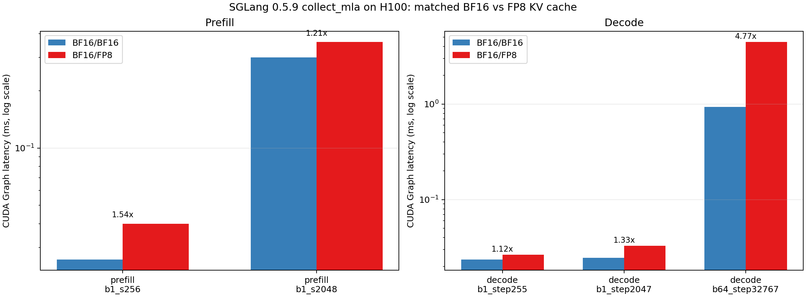
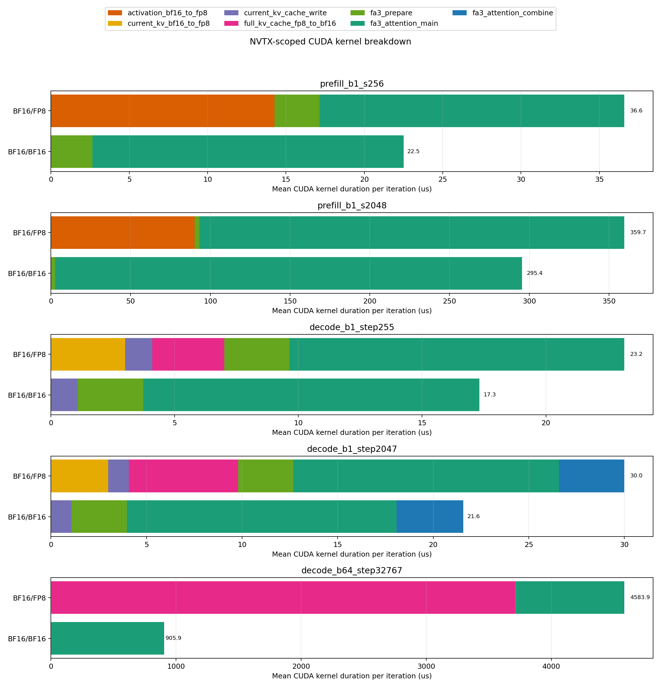

# SGLang 0.5.9基础MLA BF16/FP8差异实机分析

## 1. 结论

H100上`collect_mla`的`BF16/FP8`慢于`BF16/BF16`，prefill和decode是两种不同机制。

1. **Prefill：FP8 FA3主核并不慢，额外的Q/V量化使总边界变慢。**
   - FP8 K已在collector计时前构造完成，不在`benchmark_layer`边界内。
   - SGLang FA3后端在边界内把Q和V从BF16转为FP8，共产生两个`float8_copy_kernel_cuda`。
   - FA3主核确实切换为`cutlass::float_e4m3_t`输入；S2048时主核比BF16快约`26 us`，但Q/V量化耗时约`90 us`，最终仍慢约`1.21x`。
   - S256时主核仅节省约`0.4 us`，Q/V量化增加约`14.3 us`，最终慢约`1.54x`。

2. **Decode：FP8 cache会先被完整反量化为BF16，再执行BF16 FA3。**
   - 当前token的K-nope和K-rope先各自从BF16转为FP8，再写入FP8 cache。
   - 随后源码对`get_key_buffer(layer_id)`返回的整个已分配cache调用`.to(q.dtype)`。由于decode的MLA head dim为576，大于源码中的256阈值，Q保持BF16，因此整个FP8 cache被转回BF16。
   - Nsight中对应`direct_copy_kernel_cuda`。在`B=64,step=32767`时，逻辑上一次全池转换因TensorIterator网格规模拆成两个launch，合计`3706.8 us`，占FP8边界内GPU kernel时间的`80.9%`。
   - 两种配置最终调用的FA3主核都只含`cutlass::bfloat16_t`，所以decode的FP8 cache没有带来FP8 attention计算，只增加了存储压缩及整池反量化。

3. **“decode普遍慢数倍”需要按总cache规模理解。**
   - `B=1,step=255`实测为`1.12x`，`B=1,step=2047`为`1.33x`。
   - `B=64,step=32767`实测为`4.77x`，数据库同shape为`4.93x`。
   - slowdown随collector分配的`batch_size * (step + 1)` cache规模增长；不能用B1小shape代表整个decode数据面。

因此，本问题不是“FP8 FA3主干天然比BF16慢”。Prefill是量化前处理成本未被主核收益覆盖；decode是FA3吸收式MLA路径缺少原生FP8 cache消费能力，先完整反量化后才运行BF16主核。

## 2. 实验范围与环境

| 项目 | 配置 |
| --- | --- |
| GPU | NVIDIA H100 80GB HBM3，物理卡4，采集期间独占 |
| Docker镜像 | `booleimg.myaddr.io/lmsysorg/sglang:v0.5.9` |
| SGLang版本 | 0.5.9 |
| CUDA | 镜像内PyTorch CUDA 12.9 |
| Nsight Systems | 镜像内2026.1.1 |
| 后端 | H100默认`fa3`，数据字段`kernel_source=flash_attention` |
| 算子范围 | 基础MLA的prefill/decode，即`collect_mla.py::run_mla` |
| 排除范围 | MLA module、模型级QKV投影、计时前历史cache初始化 |
| dtype组合 | `mla_dtype=bfloat16,kv_cache_dtype=bfloat16/fp8` |

H200同属SM90且AIC数据呈现同方向现象，通常也选择FA3路径；但本次Nsight实验只在H100执行。本文对具体kernel耗时、launch数及比例的结论均为H100实测，不声称已完成H200实机trace。

## 3. 方法与边界

实验runner不复制算子构造逻辑，而是直接调用当前[`collector/sglang/collect_mla.py`](../../../sglang/collect_mla.py)，只替换其`benchmark_layer`：

- graph时延：复现collector的3次eager warmup、CUDA Graph capture、3次graph warmup和graph replay；每个shape/dtype执行3个独立进程，每进程100次。
- kernel拆分：使用相同的`RadixAttention.forward`闭包，改为eager执行10次，并给每次调用增加独立NVTX范围。
- SQLite关联：先找NVTX范围内的CUDA Runtime correlation ID，再关联对应GPU kernel，而不是直接使用全进程kernel summary。
- 历史cache构造、backend metadata初始化和JIT warmup均在NVTX及计时边界外。

Nsight注入会显著放大几十微秒小算子的CPU launch间隔，因此：

- 总时延比较以未注入Nsight的CUDA Graph结果为准。
- Nsight只用于GPU kernel构成、launch数和kernel duration。
- 大shape中Nsight kernel总时长与graph时延接近；小shape不使用Nsight eager Event时延计算BF16/FP8比例。

## 4. Collector与源码执行链

### 4.1 Prefill

Collector在进入`benchmark_layer`前构造：

```text
Q: [B*S, local_heads, 192], BF16
K: [B*S, local_heads, 192], BF16或FP8
V: [B*S, local_heads, 128], BF16
save_kv_cache = false
```

FP8配置下，[`collect_mla.py`](../../../sglang/collect_mla.py)先执行`k = k.to(kv_cache_dtype)`。这次K量化不在MLA计时边界内；基础MLA只测后续`layer(...)`。另一个`mla_concat_k_perf`表单独覆盖生产路径中的K concat/cast准备成本。

SGLang 0.5.9 `FlashAttentionBackend.forward_extend`的关键行为是：

```python
if kv_cache_dtype_str != "auto" and layer.head_dim <= 256:
    q = q.to(kv_cache_dtype)

output = flash_attn_varlen_func(
    q=q,
    k=k.to(q.dtype),
    v=v.to(q.dtype),
    ...
)
```

Prefill head dim为192，满足`<=256`：

- BF16/BF16：上述`.to(BF16)`均为no-op，直接运行BF16 FA3。
- BF16/FP8：Q在边界内量化为FP8；K已经是FP8，因此`k.to(q.dtype)`为no-op；V在边界内量化为FP8。
- Nsight主核符号确认BF16 case使用`cutlass::bfloat16_t`，FP8 case输入类型包含`cutlass::float_e4m3_t`，输出/epilogue仍包含BF16。

由此也应注意collector边界的非对称性：FP8 K准备成本位于基础MLA计时外，Q/V量化成本位于计时内。该数据忠实反映当前collector拆分，但不能把基础MLA一行解释为完整QKV量化总成本。

### 4.2 Decode

Decode collector在计时前完成历史cache构造。进入每次`layer(...)`时，当前token的Q/K-nope/K-rope仍为BF16，cache dtype由`kv_cache_dtype`决定。

SGLang 0.5.9执行顺序为：

```text
当前K-nope/K-rope
  -> 若cache是FP8，各自BF16->FP8
  -> set_mla_kv_buffer_kernel写当前token
  -> get_key_buffer(layer_id).to(q.dtype)
  -> 切分为c_kv与k_rope两个view
  -> FA3 absorbed MLA
```

这里decode的`layer.head_dim=512+64=576`，不满足`head_dim <= 256`，所以前面的Q对齐分支不生效，`q.dtype`仍为BF16。于是：

- BF16/BF16：cache本来就是BF16，`.to(q.dtype)`为no-op。
- BF16/FP8：对整个cache执行FP8->BF16转换，然后运行与BF16 case同类型的BF16 FA3主核。

“整个cache”不是只包含当前token或当前请求的少量页。Collector将pool大小设为：

```text
round_up(batch_size * (step + 1), page_size=64)
```

然后`get_key_buffer()`返回该层完整pool。`B=64,step=32767`对应2,097,152 token：日志显示BF16 pool为2.25 GB、FP8 pool为1.13 GB，但FP8路径每次调用又产生整池BF16临时张量。

## 5. Graph时延结果

表中“实测”为3个独立进程的均值中位数；“数据库”为H100 SGLang 0.5.9相同完整匹配键：

```text
mla_dtype, kv_cache_dtype, num_heads, batch_size, isl, tp_size, step
```

| Stage/shape | BF16实测(ms) | FP8实测(ms) | 实测比值 | BF16数据库(ms) | FP8数据库(ms) | 数据库比值 |
| --- | ---: | ---: | ---: | ---: | ---: | ---: |
| prefill B1/S256/H128/tp1 | 0.0260 | 0.0400 | 1.54x | 0.0230 | 0.0375 | 1.63x |
| prefill B1/S2048/H128/tp1 | 0.2993 | 0.3611 | 1.21x | 0.2951 | 0.3551 | 1.20x |
| decode B1/step255/H128/tp1 | 0.0237 | 0.0265 | 1.12x | 0.0182 | 0.0242 | 1.33x |
| decode B1/step2047/H128/tp1 | 0.0246 | 0.0328 | 1.33x | 0.0219 | 0.0303 | 1.38x |
| decode B64/step32767/H128/tp1 | 0.9364 | 4.4618 | 4.77x | 0.9027 | 4.4525 | 4.93x |



大shape与数据库非常接近，说明独立runner没有改变关键执行路径。两个B1 decode点的绝对值更容易受graph launch固定开销和系统状态影响，但方向、随step增长趋势及kernel构成都一致。

## 6. Nsight kernel归因

### 6.1 Prefill

以下为每次NVTX边界内GPU kernel duration的10次均值：

| Shape | 配置 | Q/V BF16->FP8(us) | FA3 prepare(us) | FA3主核(us) | kernel合计(us) |
| --- | --- | ---: | ---: | ---: | ---: |
| B1/S256 | BF16/BF16 | 0 | 2.65 | 19.85 | 22.50 |
| B1/S256 | BF16/FP8 | 14.28 | 2.87 | 19.45 | 36.60 |
| B1/S2048 | BF16/BF16 | 0 | 2.70 | 292.72 | 295.42 |
| B1/S2048 | BF16/FP8 | 90.19 | 2.90 | 266.57 | 359.65 |

每个FP8 prefill iteration固定多出两个`at::native::float8_copy_kernel_cuda`：

- 第一个覆盖Q，S2048时约`54.4 us`。
- 第二个覆盖V，S2048时约`35.6 us`。
- K量化不在该边界内，因此没有第三个copy kernel。

S2048的FP8 FA3主核收益为`292.72 - 266.57 = 26.16 us`，不足以抵消`90.19 us`量化成本，净增约`64.23 us`。这解释了为什么prefill只是稍慢，且小shape的相对惩罚更明显。

### 6.2 Decode

| Shape | 配置 | 当前KV BF16->FP8(us) | 当前KV写入(us) | 全池FP8->BF16(us) | FA3主核(us) | combine(us) | kernel合计(us) |
| --- | --- | ---: | ---: | ---: | ---: | ---: | ---: |
| B1/step255 | BF16/BF16 | 0 | 1.08 | 0 | 13.58 | 0 | 17.31 |
| B1/step255 | BF16/FP8 | 3.00 | 1.09 | 2.91 | 13.54 | 0 | 23.17 |
| B1/step2047 | BF16/BF16 | 0 | 1.08 | 0 | 14.11 | 3.49 | 21.58 |
| B1/step2047 | BF16/FP8 | 2.99 | 1.09 | 5.71 | 13.90 | 3.42 | 30.00 |
| B64/step32767 | BF16/BF16 | 0 | 1.59 | 0 | 894.91 | 5.15 | 905.94 |
| B64/step32767 | BF16/FP8 | 3.42 | 1.48 | 3706.84 | 862.70 | 5.10 | 4583.93 |

大decode FP8每次的8个launch依次为：

1. `float8_copy_kernel_cuda`：K-nope BF16->FP8。
2. `float8_copy_kernel_cuda`：K-rope BF16->FP8。
3. `set_mla_kv_buffer_kernel`：写当前token。
4. `direct_copy_kernel_cuda`：全池FP8->BF16，第一段约`1854 us`。
5. `direct_copy_kernel_cuda`：全池FP8->BF16，第二段约`1853 us`。
6. `prepare_varlen_num_blocks_kernel`。
7. `FlashAttnFwdSm90` BF16主核。
8. `FlashAttnFwdCombine`。

两个`direct_copy`是源码中一次`.to(q.dtype)`因大TensorIterator网格拆分后的两个CUDA launch，不是两次Python级全池转换。二者合计占FP8 kernel时间：

```text
3706.84 / 4583.93 = 80.9%
```

FP8 case的FA3主核还比BF16 case快约`32.2 us`，但相对3.7 ms全池反量化可忽略。FP8相对BF16增加的约`3678 us`几乎全部由当前KV量化与全池反量化解释。



## 7. 数据解释与需关注细节

### 7.1 `kv_cache_dtype=fp8`不等于FA3主核一定执行FP8

- Prefill head dim 192触发dtype对齐，主核确实为FP8输入。
- Decode absorbed MLA head dim 576绕过Q量化，cache又被`.to(BF16)`，主核仍为BF16。
- 因此应同时看stage、head dim、backend源码和kernel符号，不能仅按保存字段推断实际attention精度。

### 7.2 当前数据是框架边界性能，不是孤立attention kernel性能

Collector计时闭包是`layer(q,k,v,forward_batch,...)`。后端在该调用内主动执行的量化、cache写入和反量化都属于数据成果的一部分。若SDK用这张表估算框架执行延迟，应保留这些成本；若要比较纯FA3主核，应另建kernel级表，不能直接复用基础MLA总时延。

### 7.3 Prefill的K成本被拆到另一张表

当前基础MLA FP8 prefill只包含Q/V量化，不包含K concat/cast。分析总链路时需要把`mla_concat_k_perf`对应成本一并考虑，否则会低估完整FP8准备开销。

### 7.4 Decode全池转换可能放大生产环境风险

Standalone collector的pool仅按当前case最小尺寸分配，生产SGLang通常使用更大的静态token pool。如果相同FA3代码直接对完整生产pool执行`.to(BF16)`，实际成本和临时显存压力可能比collector更大。是否存在模型runner、CUDA graph或其他上层路径规避，需要用生产服务trace单独验证；本次不把该推论当作已实测事实。

## 8. 建议

1. **数据字段补充实际执行信息。** 在MLA数据或旁路metadata中记录`effective_qkv_dtype`、`effective_attention_kernel_dtype`、是否发生cache materialization，避免只凭`mla_dtype/kv_cache_dtype`误判。
2. **保留当前总边界数据，同时增加kernel拆分标识。** 当前结果对SDK模拟框架总延迟有价值，但应注明prefill包含Q/V量化、decode包含整池反量化。
3. **SGLang decode后端优先修复全池`.to(q.dtype)`。** 理想方案是FA3直接消费FP8 MLA cache并在kernel内按tile反量化；次优方案是仅转换实际活跃页，而不是完整pool。若后端不支持，应显式拒绝该组合或使用BF16 cache，避免“节省cache显存但每层每token全池反量化”。
4. **优化后必须重新采集H100/H200。** 修复会改变整个decode数据面，尤其大`batch * step`区域，旧数据不能混用。

## 9. 产物

- 实验入口：[`run_suite.py`](run_suite.py)
- 精确边界runner：[`profile_collect_mla.py`](profile_collect_mla.py)
- SQLite/NVTX解析和作图：[`analyze_nsys.py`](analyze_nsys.py)
- graph时延汇总：[`results/summary/bf16_fp8_pair_summary.csv`](results/summary/bf16_fp8_pair_summary.csv)
- kernel分类汇总：[`results/summary/kernel_category_summary.csv`](results/summary/kernel_category_summary.csv)
- 逐launch原始表：[`results/summary/kernel_launches.csv`](results/summary/kernel_launches.csv)
- 0.5.9源码证据：[`results/source_evidence/`](results/source_evidence/)
- 原始Nsight报告：[`results/nsys/`](results/nsys/)

仓库根`.gitignore`忽略所有`results/`目录，因此原始报告、SQLite、CSV和图片保存在本机工作目录中，但不会出现在普通`git status`中。脚本和本文档可正常纳入版本管理。
