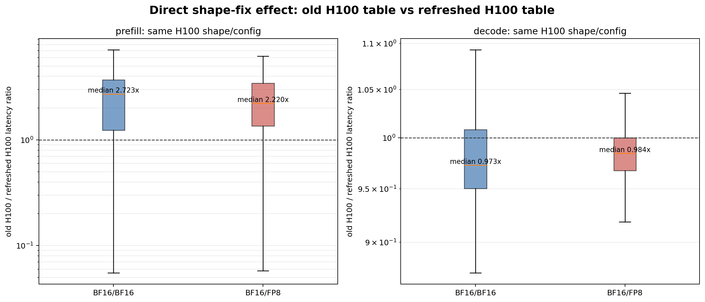
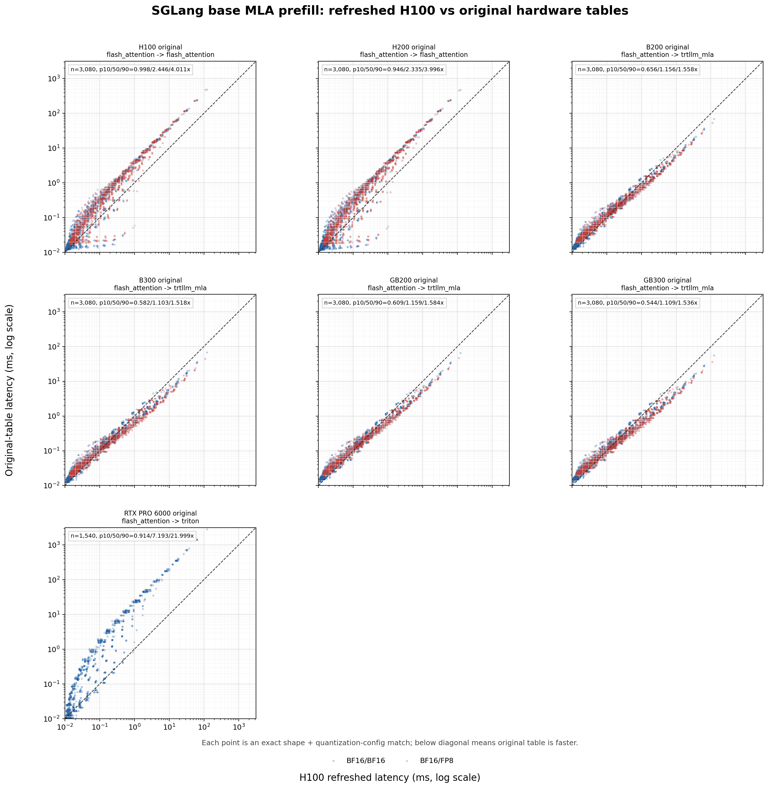
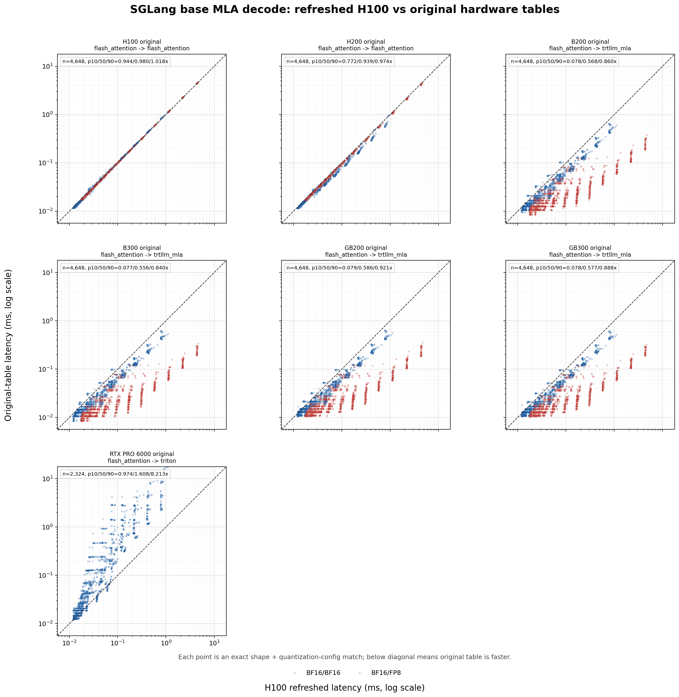
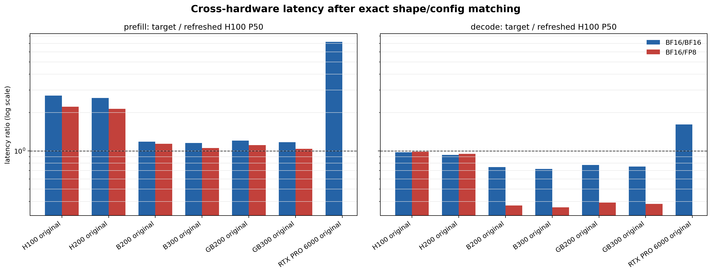

# SGLang MLA prefill形状修复跨硬件数据核查

## 1. 核查对象与最终结论

本次核查针对基础MLA的`context_mla_perf.txt` / `generation_mla_perf.txt`，不包含MLA module。正确参考数据是H100 SGLang 0.5.9重采表；H100旧0.5.10表和其他硬件SGLang 0.5.10表作为原始数据集。

结论明确：

1. **H100旧prefill数据确认受到形状bug影响。** 与同卡、同shape、同量化配置的0.5.9正确表相比，旧0.5.10表P10/P50/P90为0.998/2.446/4.011倍；BF16/BF16 P50为2.723倍，BF16/FP8为2.220倍。
2. **大shape约3倍的经验成立。** H100旧/新prefill在large组的综合P50为3.639倍；分量化配置为BF16/BF16 3.768倍、BF16/FP8 3.247倍。small组综合P50仅1.216倍，固定launch/调度成本使小shape不呈线性维度缩放。
3. **decode是有效阴性对照。** H100旧/新decode P10/P50/P90仅0.944/0.980/1.018倍；BF16/BF16与BF16/FP8 P50分别0.973/0.984。修复没有改变decode absorbed-MLA路径，数据也没有出现2~4倍偏差。
4. **H200原表具有与H100旧表高度一致的bug指纹。** H200原prefill相对正确H100 P50为2.335倍，large P50为3.618倍；H200 decode相对正确H100仅0.939倍。H100/H200都使用`flash_attention`，且旧collector的FA3 prefill都会落入`512+64` absorbed形态，因此H200 context表应判定为待重采。
5. **Blackwell原表不能与H200一并简单判坏。** B200/B300/GB200/GB300使用`trtllm_mla`，旧代码已经对该backend的context维度做过`192/128`特殊处理；其prefill P50仅为正确H100的1.10~1.16倍，并伴随100% backend切换。它们未经过最终版local-KV-head/fail-closed验证，仍建议重采，但现有数据不呈Hopper的2.3~4倍bug指纹。
6. **RTX原表不可作为正确Triton基线。** 它只有BF16/BF16，prefill P50为正确H100的7.193倍、large P50为19.411倍，且backend从FA3变为Triton。当前修复已直接禁采无法保证DeepSeek MHA分支的Triton context，因此该旧表应隔离，而不是用于跨卡性能排名。

## 2. 修复到底改变了什么

修复提交为`4fa83267 fix sglang mla prefill collection`。用户提供的修改说明见 [修改概要](<../../../../.self/docs/[修改说明]SGLang-MLA-prefill采集修复与0.5.9数据刷新概要.md>)。

旧Hopper FA3 prefill错误使用decode/absorbed MLA形态：

```text
Q/K head_dim = 512 + 64 = 576
V head_dim   = 512
KV heads     = 1
```

修复后强制匹配SGLang DeepSeek V3非absorbed MHA prefill：

```text
Q/K head_dim = 128 + 64 = 192
V head_dim   = 128
KV heads     = local_num_heads
attn_attend_prefix_cache = false
save_kv_cache = false for this no-prefix core benchmark
```

实机路径中的K拼接/转换被拆成独立`mla_concat_k` collector，不计入此attention core表。因此本文测得的2.446倍不能只解释为“576/192=3”：它同时包含维度、KV head布局、分支选择、cache-write边界及0.5.9/0.5.10版本差异。decode旧/新约0.98倍说明版本差异本身较小，但仍不能声称这是纯粹的单变量维度实验。

## 3. 数据与匹配口径

### 3.1 数据集

| 角色 | 硬件/版本 | prefill kernel_source | 已知状态 |
|---|---|---|---|
| 正确参考 | H100 / SGLang 0.5.9 | `flash_attention` | 已按192/128 MHA形态重采 |
| 同卡旧表 | H100 / 0.5.10 | `flash_attention` | 旧FA3 absorbed形状 |
| 同backend原表 | H200 / 0.5.10 | `flash_attention` | 未刷新，旧FA3 absorbed形状 |
| 跨backend原表 | B200/B300/GB200/GB300 / 0.5.10 | `trtllm_mla` | 旧代码已有192/128维度分支，但未经过最终版完整校验 |
| 跨backend原表 | RTX PRO 6000 / 0.5.10 | `triton` | 未刷新；当前脚本已禁采该context路径 |

A100/L40S没有同口径SGLang基础MLA context/generation表，因此不进入比较。

### 3.2 严格匹配键

每个点按以下全部字段精确join：

```text
mla_dtype, kv_cache_dtype, num_heads, batch_size, isl, tp_size, step
```

H100/H200/数据中心Blackwell的prefill各有3,080/3,080点完全匹配，decode各有4,648/4,648点完全匹配。RTX只存在BF16/BF16，所以prefill匹配1,540点、decode匹配2,324点，BF16/FP8明确记为缺失而非插值。

逻辑shape大小代理为：

- prefill：`batch_size * num_heads * isl`
- decode：`batch_size * num_heads * step`

每个stage下四分位为small，上四分位为large。该代理刻画配置表中的逻辑shape，故意不把隐藏的192/128或576/512乘进去；否则会把待检测的bug维度提前编码进匹配轴。

## 4. H100同卡直接证据



| stage/配置 | 匹配点 | P10 | P50 | P90 | small P50 | large P50 |
|---|---:|---:|---:|---:|---:|---:|
| prefill BF16/BF16 | 1,540 | 0.965 | 2.723 | 3.979 | 1.133 | 3.768 |
| prefill BF16/FP8 | 1,540 | 1.036 | 2.220 | 4.052 | 1.304 | 3.247 |
| decode BF16/BF16 | 2,324 | 0.935 | 0.973 | 1.031 | 0.954 | 1.022 |
| decode BF16/FP8 | 2,324 | 0.956 | 0.984 | 1.006 | 0.967 | 1.003 |

prefill P10接近1而P90约4，说明错误不是所有shape上的固定3倍常数。小shape受固定开销主导；随着token-head工作量增加，旧576/512路径的额外数据量和计算量才成为主导。该趋势的workload-ratio Spearman相关性为0.695。

## 5. H100正确表与其他硬件原表

### 5.1 prefill



| 原表 | backend变化 | 匹配点 | P10/P50/P90 | BF16/BF16 P50 | BF16/FP8 P50 | small/large P50 | 判定 |
|---|---:|---:|---|---:|---:|---:|---|
| H100 0.5.10 | 否 | 3,080 | 0.998/2.446/4.011 | 2.723 | 2.220 | 1.216/3.639 | 同卡直接确认bug |
| H200 0.5.10 | 否 | 3,080 | 0.946/2.335/3.996 | 2.599 | 2.135 | 1.185/3.618 | 同FA3 bug指纹，优先重采 |
| B200 0.5.10 | 是 | 3,080 | 0.656/1.156/1.558 | 1.181 | 1.134 | 1.285/0.797 | backend/架构效应为主 |
| B300 0.5.10 | 是 | 3,080 | 0.582/1.103/1.518 | 1.151 | 1.051 | 1.256/0.732 | backend/架构效应为主 |
| GB200 0.5.10 | 是 | 3,080 | 0.609/1.159/1.584 | 1.202 | 1.111 | 1.341/0.749 | backend/架构效应为主 |
| GB300 0.5.10 | 是 | 3,080 | 0.544/1.109/1.536 | 1.171 | 1.038 | 1.313/0.691 | backend/架构效应为主 |
| RTX 0.5.10 | 是 | 1,540 | 0.914/7.193/21.999 | 7.193 | 无数据 | 1.059/19.411 | 旧Triton表应隔离 |

H200是唯一同时满足“相同FA3 backend、全shape/量化配置覆盖、未刷新”的其他硬件。其曲线、分位数及随shape增大的趋势都与H100旧表高度一致。H200 decode相对正确H100 P50为0.939，说明H200正常路径本应略快；若用该decode比例粗略归一化，H200 prefill异常因子约为`2.335 / 0.939 = 2.49`，与H100同卡的`2.446 / 0.980 = 2.49`几乎一致。这是H200 context表需要刷新最强的数据证据。

Blackwell的small/large关系反而是“小shape略慢、大shape更快”，不呈Hopper旧表随规模升至3~4倍的形态。由于backend已切成`trtllm_mla`，这些点只能证明“没有同样的FA3 bug指纹”，不能证明旧Blackwell表完全符合当前最终collector边界。

### 5.2 decode对照



| 原表 | P10/P50/P90 | BF16/BF16 P50 | BF16/FP8 P50 | 解释 |
|---|---|---:|---:|---|
| H100 0.5.10 | 0.944/0.980/1.018 | 0.973 | 0.984 | 同卡、同backend，旧新基本重合 |
| H200 0.5.10 | 0.772/0.939/0.974 | 0.930 | 0.946 | H200正常硬件优势约6% |
| B200/B300/GB200/GB300 | P50 0.556~0.586 | 0.720~0.775 | 0.359~0.392 | `trtllm_mla` backend差异，尤其FP8路径更快 |
| RTX 0.5.10 | 0.974/1.608/8.213 | 1.608 | 无数据 | Triton且只有BF16，随shape增大显著变慢 |

decode不是本次需要刷新的bug对象；跨backend比值仅用于验证prefill异常是否为通用硬件速度差。它不应被用来推导统一的跨stage性能缩放。

### 5.3 P50总览



图中横线为1，即与正确H100相同。H100/H200旧prefill明显高于1，而同卡decode回到1附近；这是最直观的异常定位。Blackwell decode低于1主要是backend和硬件差异，并不构成对prefill形状正确性的独立验证。

## 6. 数据库处理建议

| 优先级 | 数据集 | 建议 |
|---|---|---|
| P0 | H100 SGLang 0.5.10 `context_mla_perf.txt` | 用修复后collector重采或明确标记invalid；不能继续作为正确prefill性能表 |
| P0 | H200 SGLang 0.5.10 `context_mla_perf.txt` | 优先重采；数据与源码均指向同一FA3形状bug |
| P0 | RTX SGLang 0.5.10 `context_mla_perf.txt` | 隔离；当前collector已拒绝该Triton context路径，不应继续提供SILICON查询 |
| P1 | B200/B300/GB200/GB300 context表 | 最终版collector下补采校验；旧表维度分支较接近正确形态，但缺少local-KV-head和fail-closed保证 |
| 无需因本bug重采 | 各平台`generation_mla_perf.txt` | decode维度本来就是512+64 absorbed MLA；若重采应作为版本更新而非本bug修复 |

schema层面建议把隐藏的执行形状显式保存：`qk_head_dim`、`v_head_dim`、`num_kv_heads`、`attention_form=mha/absorbed_mla`、`includes_cache_write`。当前表的逻辑key完全相同，却能对应两套不同物理shape，这是本次错误长期未被数据层识别的根因。

## 7. 复现与机器可读结果

- [分析脚本](analyze_mla_shape_fix.py)
- [逐点匹配数据](results/matched_shape_config_points.csv.gz)
- [覆盖率](results/pair_coverage_summary.csv)
- [汇总统计](results/hardware_latency_summary.csv)

脚本只读`systems/data`，不会修改数据库。完整复现命令见 [README](README.md)。
