# Attention 与基础 MLA dtype 全链路分析

> **文档状态：当前最终版。** 本文落实 `stage × engine` 组合清单、引擎独立作图以及P10/P50/P90与small/large规模分析；旧的根目录dtype核查文档仅作为历史材料保留。

## 1. 范围与结论

本文只分析两类基础算子：

- 普通 Attention：`context_attention_perf.txt` / `generation_attention_perf.txt`
- 基础 MLA：`context_mla_perf.txt` / `generation_mla_perf.txt`

明确排除 MLA module、WideEP MLA、DSA module 和其他组合 module。分析覆盖 SGLang、TensorRT-LLM（下文简称 TRT-LLM）和 vLLM，并以 `prefill/decode × engine` 为主轴，依次核对 collector 设计组合、数据实存组合、引擎行为、SDK查询和数据表现。

组合统一写成 `attn_dtype/kv_cache_dtype` 或 `mla_dtype/kv_cache_dtype`。最重要的结论是：**不存在一个跨引擎、跨backend都成立的“Attention dtype”单字段语义。**

| 概念 | 含义 | 当前字段能否准确表达 |
|---|---|---|
| 保存标签 | CSV中的 `attn_dtype` / `mla_dtype` | 能表达标签本身，不能保证表达真实kernel dtype |
| 初始输入dtype | collector创建Q/K/V或latent tensor时的dtype | 没有独立字段 |
| KV存储dtype | paged KV cache的物理元素格式 | `kv_cache_dtype`基本能表达 |
| 核心kernel模式 | launch时Q/K/V dtype、compute路径和kernel variant | 不能由任一现有字段单独确定 |
| 量化边界 | timer外、timer内独立执行或融合进cache write/attention | 没有字段 |

此前四项判断的核实结果：

| 原判断 | 结论 | 必须澄清之处 |
|---|---|---|
| `attn_dtype` / `mla_dtype` 都是冗余项 | **不成立** | `mla_dtype`在基础MLA collector中确实只是固定BF16标签；但`attn_dtype`会控制SGLang/TRT-LLM prefill路径，context SDK也把两者作为查询key |
| 两字段固定BF16并决定初始QKV，KV不一致时timer内量化 | **仅部分成立** | 基础输入通常由collector代码固定BF16，而不是保存字段反向决定；SGLang FP8 Attention在timer外转换，TRT-LLM保留BF16输入并在timed runtime中解释FP8配置 |
| `kv_cache_dtype`才真正影响实际Attention量化格式 | **方向正确但不充分** | 它稳定决定cache存储，并经常影响backend、Q dtype和kernel；hardware、phase、backend能力及显式compute quant config仍会改变结果 |
| SDK也只由`kv_cache_dtype`决定精度 | **不成立** | SILICON context Attention/MLA保留compute dtype一级key；decode才没有该轴；SOL又存在从KV dtype推导compute mode的强假设 |

一句话概括：`kv_cache_dtype`是重要的真实控制量，但不能等价成“Attention核心算子精度”；普通Attention prefill的`attn_dtype`不是冗余字段；基础MLA的`mla_dtype`在collector侧基本是固定标签，却仍被context SDK当作有效索引。

## 2. 数据、作图与证据口径

### 2.1 版本和shape匹配

脚本显式选择版本，避免新数据目录进入后静默改变结果：

| 算子 | SGLang | TRT-LLM | vLLM |
|---|---|---|---|
| Attention | 全平台0.5.10 | A100/L40S为1.0.0；其余为1.3.0rc10 | A100/L40S为0.14.0；其余为0.19.0 |
| 基础MLA | H100/H200/Blackwell/RTX为0.5.10 | A100/L40S为1.0.0；其余为1.3.0rc10 | 仅A100/L40S/H100/H200的历史0.14.0数据 |

共读取1,528,760行。每个散点都在同一硬件、引擎和stage内，按SDK查询key匹配同一个shape：

- Attention prefill：`B, S, H, Hkv, D, window`
- Attention decode：`B, total_seq_len, H, Hkv, D, window`
- 基础MLA prefill：`num_heads, B, S`
- 基础MLA decode：`num_heads, B, total_seq_len`

`beam_width`和MLA行中的`tp_size`不属于当前SDK key；重复key与loader一致采用first-row-wins。所有图都以BF16/BF16 latency为横轴，其他dtype组合为纵轴，低于对角线代表目标组合更快。ratio统一为`target / BF16-BF16 baseline`。

### 2.2 大小算子和分位数

每个硬件 `.txt` 表独立计算shape工作量代理：

| 算子/stage | 工作量代理 |
|---|---|
| Attention prefill | `B * H * D * S * attended_S` |
| Attention decode | `B * H * D * total_S` |
| MLA prefill | `B * H * S^2` |
| MLA decode | `B * H * total_S` |

BF16/BF16基准shape的下四分位定义为small，上四分位定义为large。图中每个组合都显示overall P10/P50/P90以及small/large P50；完整统计还包含胜率、工作量-ratio Spearman相关性和kernel_source变化率。

### 2.3 文件和源码证据

分析脚本与机器可读结果：

- [`analyze_dtype_data.py`](analyze_dtype_data.py)
- [`data_inventory.csv`](results/data_inventory.csv)
- [`kernel_source_by_dtype.csv`](results/kernel_source_by_dtype.csv)
- [`dtype_pair_summary.csv`](results/dtype_pair_summary.csv)
- [`baseline_comparison_points.csv.gz`](results/baseline_comparison_points.csv.gz)
- [`size_stratified_summary.csv`](results/size_stratified_summary.csv)

本地collector/SDK证据：

- [SGLang Attention collector](../../../sglang/collect_attn.py) / [基础MLA collector](../../../sglang/collect_mla.py)
- [TRT-LLM Attention collector](../../../trtllm/collect_attn.py) / [MLA v1](../../../trtllm/collect_mla_v1.py) / [MLA v2](../../../trtllm/collect_mla_v2.py)
- [vLLM Attention collector](../../../vllm/collect_attn.py) / [registry](../../../vllm/registry.py)
- [SDK loader/query](../../../../src/aiconfigurator/sdk/perf_database.py) / [Operation参数传导](../../../../src/aiconfigurator/sdk/operations.py)

在线引擎源码以对应tag为准，通过用户提供的代理核查：

- [SGLang v0.5.10 FlashAttention](https://github.com/sgl-project/sglang/blob/v0.5.10/python/sglang/srt/layers/attention/flashattention_backend.py)
- [SGLang v0.5.10 TRT-LLM MHA](https://github.com/sgl-project/sglang/blob/v0.5.10/python/sglang/srt/layers/attention/trtllm_mha_backend.py)
- [SGLang v0.5.10 TRT-LLM MLA](https://github.com/sgl-project/sglang/blob/v0.5.10/python/sglang/srt/layers/attention/trtllm_mla_backend.py)
- [TRT-LLM v1.3.0rc10 runtime](https://github.com/NVIDIA/TensorRT-LLM/blob/v1.3.0rc10/tensorrt_llm/_torch/attention_backend/trtllm.py)
- [vLLM v0.19.0 Attention layer](https://github.com/vllm-project/vllm/blob/v0.19.0/vllm/model_executor/layers/attention/attention.py)
- [vLLM v0.19.0 FlashAttention](https://github.com/vllm-project/vllm/blob/v0.19.0/vllm/v1/attention/backends/flash_attn.py)
- [vLLM v0.14.0 FlashMLA](https://github.com/vllm-project/vllm/blob/v0.14.0/vllm/v1/attention/backends/mla/flashmla.py)

## 3. 普通 Attention：stage × engine

### 3.1 prefill × SGLang

| 项目 | 明确结果 |
|---|---|
| collector设计组合 | A100/L40S：BF16/BF16；SM90及以上：BF16/BF16、BF16/FP8、FP8/FP8 |
| 数据实存组合 | 与设计一致；H100/H200/Blackwell/RTX均有三种，A100/L40S仅BF16/BF16 |
| 缺失/异常 | 未发现超出设计的组合；A100/L40S无目标组合 |
| 初始输入 | Q/K/V先以BF16创建；FP8/FP8在timer外将Q/K/V转为FP8；BF16/FP8以BF16输入进入timer |
| 计时边界 | BF16/FP8可能包含backend内cast/quant、cache write和Attention主干；FP8/FP8不包含collector外部三次cast |

| 硬件 | kernel_source | BF16/FP8相对基准 | FP8/FP8相对基准 | 解释 |
|---|---|---|---|---|
| H100/H200 | `flash_attention` | P50 0.917/0.930；small约1.00，large 0.812/0.818 | 与BF16/FP8近乎重合 | FA3按条件把Q/K/V向KV dtype对齐 |
| B200/B300/GB200/GB300 | `trtllm_mha` | P50 0.881~0.987；large 0.800~0.915 | 与BF16/FP8近乎重合 | prefill转FP8并支持融合cache quant/write |
| RTX PRO 6000 | `triton` | P10/P50/P90=1.081/1.255/1.783；small/large=1.419/1.503 | 0.637/0.733/0.807；small/large=0.800/0.727 | Triton不做同样的Q对齐，两个目标组合方向相反 |

Hopper与数据中心Blackwell中，BF16/FP8和FP8/FP8延迟近乎相同；RTX上FP8/FP8相对BF16/FP8的P50约0.505。这证明同名`attn_dtype`在不同backend上不是同一种执行语义。

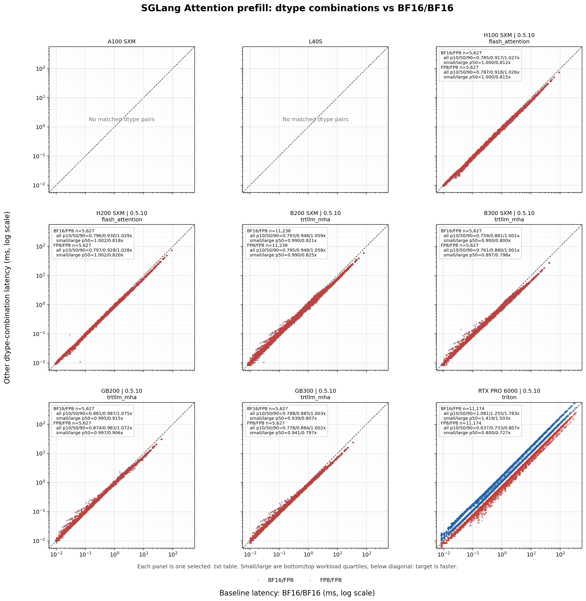

### 3.2 prefill × TRT-LLM

| 项目 | 明确结果 |
|---|---|
| collector设计组合 | A100：BF16/BF16；L40S及更新平台：BF16/BF16、BF16/FP8、FP8/FP8 |
| 数据实存组合 | 与设计一致；个别组合有1~72个shape不对称，精确匹配时已排除 |
| 缺失/异常 | A100无FP8组合；其余平台两种目标组合均存在 |
| 初始输入 | 所有组合都创建BF16 `q`、`kv`和fused `input_qkv` |
| 计时边界 | `attn_dtype=fp8`成为`QuantConfig(FP8)`，KV FP8成为cache quant mode；二者与cache update、Attention一起进入timed `forward()` |

FP8/FP8不是SGLang式“timer外FP8 tensor”，而是“BF16输入 + timer内runtime FP8配置”。源码能证明量化语义和主干都处于计时边界内，但不能证明每个shape一定发射独立quant kernel；独立kernel数量仍需Nsight trace。

| 硬件 | BF16/FP8：P10/P50/P90 | FP8/FP8：P10/P50/P90 | small/large P50与结论 |
|---|---|---|---|
| L40S | 0.955/0.997/1.029 | 0.619/0.970/1.500 | FP8/FP8由1.234降到0.716，明显规模反转 |
| H100/H200 | 约0.816/0.974~0.981/1.300 | 约0.835/0.973~0.979/1.29 | 两组合都是小算子略慢、大算子更快 |
| B200/B300/GB200/GB300 | BF16/FP8 P50约1.004 | FP8/FP8 P50 0.902~0.921 | 只有显式FP8 compute模式在大算子稳定获益 |
| RTX PRO 6000 | 0.944/0.995/1.014 | 0.611/1.381/2.113 | FP8/FP8整体变慢且离散很大 |

所有平台的保存`kernel_source`都是`torch_flow`，但结果随架构显著变化，说明该字段没有记录到实际C++ kernel family/variant层级。

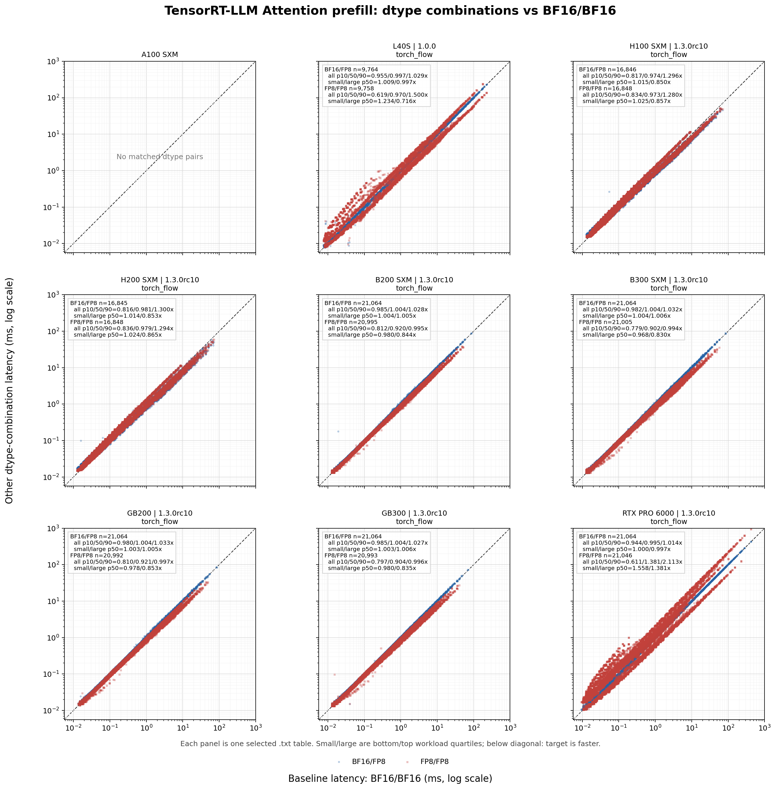

### 3.3 prefill × vLLM

| 项目 | 明确结果 |
|---|---|
| collector设计组合 | A100：BF16/BF16；L40S及更新平台：BF16/BF16、BF16/FP8 |
| 数据实存组合 | 与设计一致；没有FP8/BF16或FP8/FP8 `attn_dtype` sweep |
| 缺失/异常 | A100无FP8 KV；H200目标表多4个未配对shape |
| 初始输入 | Q/K/V固定BF16；`attn_dtype`恒保存BF16 |
| 计时边界 | collector直接调用backend `impl.forward()`，包含当前token cache write，但绕过生产`Attention.forward()`外层 |

vLLM v0.19.0生产代码可能在外层按backend能力调用`QuantFP8`量化Query；collector绕过这一层，所以BF16/FP8点不一定包含完整生产Attention layer中的Q quant开销。

| 硬件 | kernel变化 | P10/P50/P90 | small/large P50 | 判读 |
|---|---:|---|---|---|
| L40S | FlashAttention -> FlashInfer，100% | 0.140/0.924/2.072 | 1.440/0.261 | 强规模反转，差异同时含dtype和backend变化 |
| H100/H200 | 不变，FlashAttention | 约0.919/1.000~1.005/1.21 | 约0.99/1.04~1.08 | 小算子略快、大算子略慢 |
| B200/B300/GB200/GB300 | 不变，FlashInfer | P50 0.865~0.921 | small 0.949~0.972，large 0.769~0.881 | 大算子收益更明显 |
| RTX PRO 6000 | FlashAttention -> FlashInfer，100% | 0.025/0.553/1.522 | 1.014/0.067 | 极强规模反转，不能解释成纯FP8收益 |

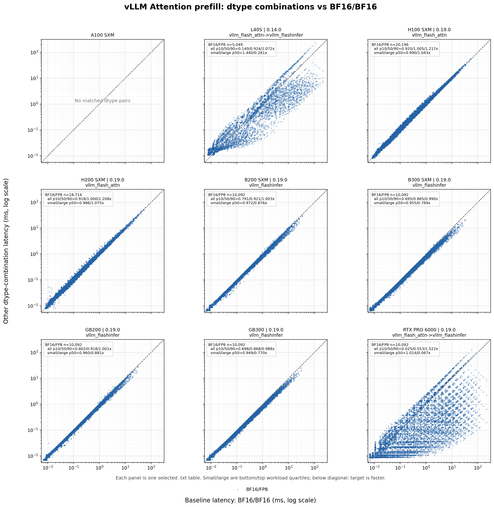

### 3.4 decode × SGLang

| 项目 | 明确结果 |
|---|---|
| collector设计组合 | A100/L40S：BF16/BF16；H100及更新平台：BF16/BF16、BF16/FP8 |
| 数据实存组合 | 与设计一致；`attn_dtype`恒为BF16，没有FP8/FP8 |
| 初始输入与计时 | 新token Q/K/V为BF16；cache write/量化和backend Attention位于timer内 |
| backend差异 | Hopper FA3可按条件转Q；Blackwell XQA允许BF16 Q，非XQA才转FP8；RTX Triton不统一向KV dtype对齐 |

H100/H200的BF16/FP8 P50为0.979/0.984，但P10低至0.630/0.745，收益集中在部分shape。Blackwell P50为0.876~0.891，small约0.98~0.99、large 0.626~0.675。RTX由small 1.243转为large 0.577，overall P10/P50/P90=0.523/1.000/1.307，是明确规模反转而非“没有差异”。

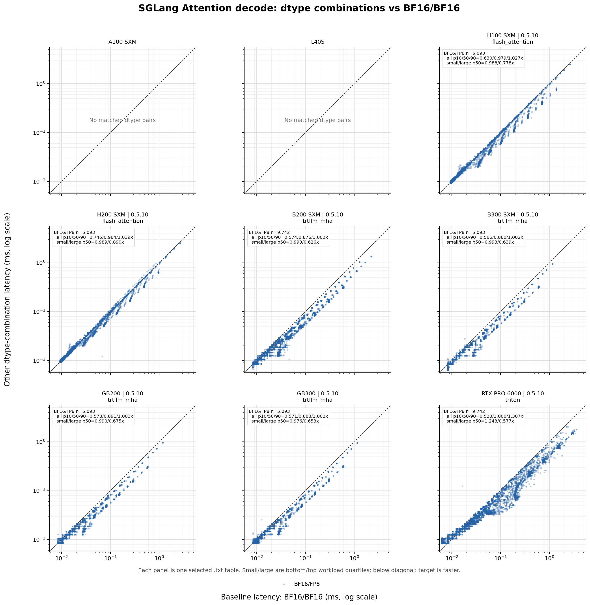

### 3.5 decode × TRT-LLM

| 项目 | 明确结果 |
|---|---|
| collector设计组合 | A100：BF16/BF16；L40S及更新平台：BF16/BF16、BF16/FP8 |
| 数据实存组合 | 与设计一致；H100/H200的FP8表只覆盖9,381个shape，BF16端另有5,676个shape不可比较 |
| 初始输入与计时 | BF16 fused QKV；quant mode、KV update和Attention统一在timed `forward()`内 |
| kernel可见性 | 数据只保存`torch_flow`，无法区分XQA、FMHA或量化是否融合 |

L40S P10/P50/P90=0.718/1.728/3.980，主体显著变慢且长尾很宽。H100/H200约为0.288/0.535/0.79，small 0.69~0.70、large约0.49，方向完全相反。Blackwell/RTX overall P50约0.906~0.996，但small为1.019~1.151、large为0.734~0.892，5个平台都出现“小算子更慢、大算子更快”。

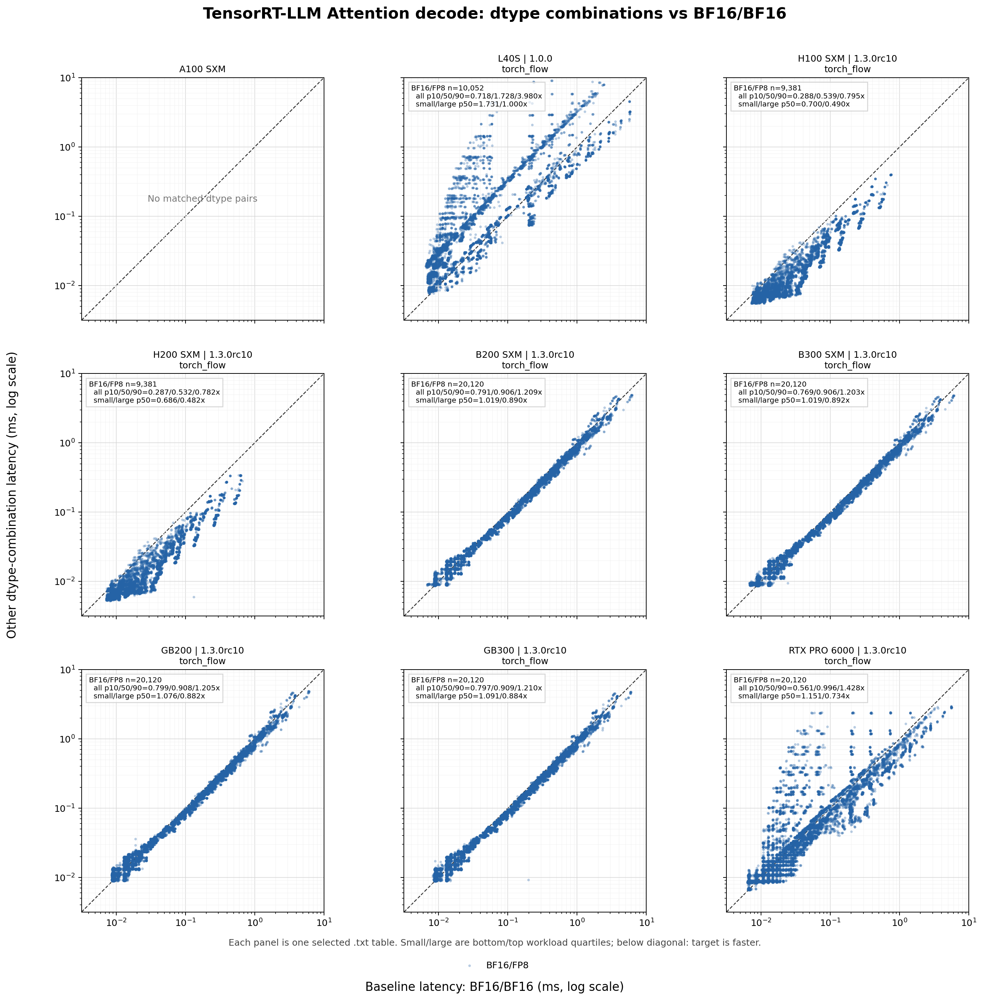

### 3.6 decode × vLLM

| 项目 | 明确结果 |
|---|---|
| collector设计组合 | A100：BF16/BF16；L40S及更新平台：BF16/BF16、BF16/FP8 |
| 数据实存组合 | 与设计一致；`attn_dtype`恒为BF16 |
| 初始输入与计时 | BF16输入并直接调用backend impl；与prefill一样绕过生产外层Query quant |
| backend差异 | L40S/RTX从FlashAttention切到FlashInfer；Hopper保持FlashAttention；数据中心Blackwell保持FlashInfer |

L40S发生100% backend切换，P10/P50/P90=0.484/0.846/1.251，small 1.132、large 0.513。H100/H200整体接近1，但large约0.94。Blackwell P50为0.833~0.850，large约0.57。RTX也发生100%切换，P10/P50/P90=0.284/0.668/1.011。这些切换场景只能描述配置变化后的backend差异，不能作为纯KV量化因果结论。

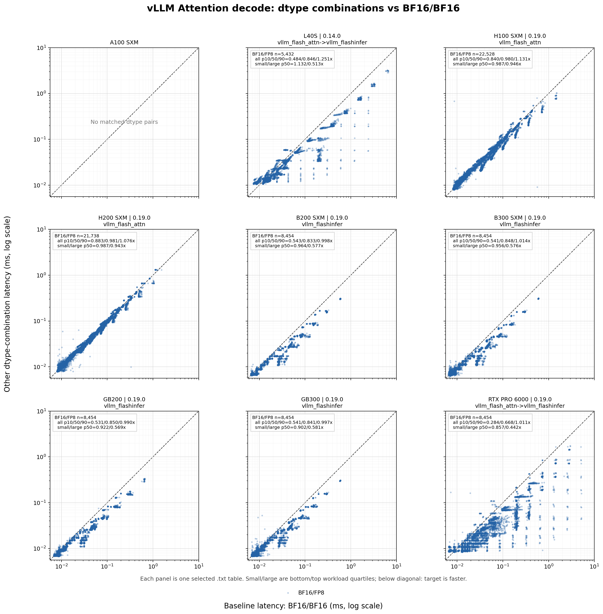

## 4. 基础 MLA：stage × engine

本章只讨论基础MLA。三个collector都以BF16 activation为起点，`mla_dtype`没有独立sweep，也不是传给backend的compute quant knob；理论上的有效目标组合只有BF16/FP8。

### 4.1 prefill × SGLang

| 项目 | 明确结果 |
|---|---|
| collector设计组合 | A100/L40S不采；H100/H200和数据中心Blackwell采BF16/BF16、BF16/FP8；RTX Triton只采BF16/BF16 |
| 数据实存组合 | 与设计一致；RTX仅BF16/BF16，其他六个平台有两种组合 |
| 初始输入 | Q、K-nope、K-rope、V均先创建BF16；Hopper为适配concat target会在timer外预转拼接K |
| 计时边界 | no-prefix prefill传`save_kv_cache=False`，不包含最终KV cache写入；主要是dtype转换和Attention主干 |

H100/H200使用`flash_attention`，Blackwell使用`trtllm_mla`。六个平台overall P50都显示BF16/FP8慢15%~22%，但统一存在规模反转：small P50为1.372~1.435，large P50为0.895~0.982；overall P10约0.84~0.97而P90约1.42~1.49。小算子中转换成本占优，大算子才接近或超过BF16基准。

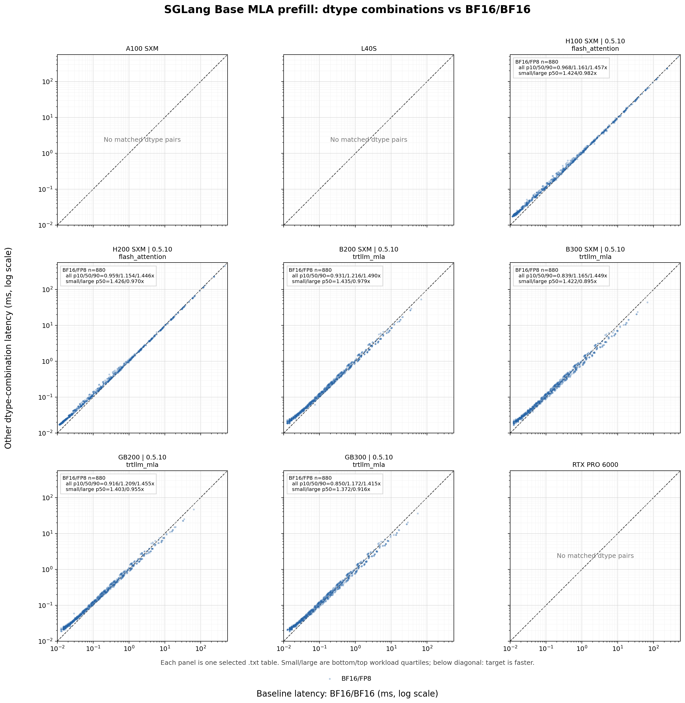

### 4.2 prefill × TRT-LLM

| 项目 | 明确结果 |
|---|---|
| v2 collector设计组合 | H100/H200/Blackwell/RTX：BF16/BF16、BF16/FP8；activation固定BF16，FP8只经KV quant config传导 |
| v1 collector设计组合 | A100/L40S源码明确只允许BF16/BF16 |
| 数据实存组合 | 九个平台都出现BF16/BF16、BF16/FP8 |
| 关键异常 | A100/L40S的FP8行违反v1断言和保存逻辑，不可视为真实FP8结果 |

v2 timed `attn_mla.forward(q,k,v,...)`包含context runtime op和相关cache/update语义。H100 P10/P50/P90=0.961/1.185/1.500，small/large=1.199/1.031；H200及Blackwell/RTX多数由small>1转为large<1，其中B300为1.269 -> 0.894，RTX为1.075 -> 0.731。只看overall P50会得到“多数平台慢约16%~19%”，但大小算子实际方向不同。

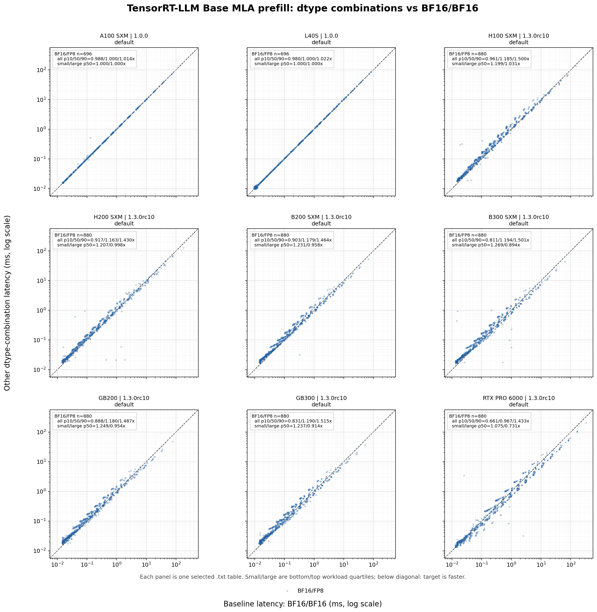

### 4.3 prefill × vLLM（历史数据）

| 项目 | 明确结果 |
|---|---|
| collector设计/版本 | 仅历史0.14.0基础MLA；A100/L40S只采BF16/BF16，H100/H200采BF16/BF16、BF16/FP8 |
| 数据实存组合 | 与历史设计一致；H100/H200各有808个可匹配shape，FP8端各少72个shape |
| 当前状态 | 当前registry已移除基础MLA collector，只保留MLA module；没有Blackwell/RTX基础MLA数据 |
| backend变化 | H100/H200由`vllm_flash_attn_mla`切到`vllm_flashmla`，变化率100% |

H100/H200 P10/P50/P90分别为0.806/1.016/1.926和0.756/1.014/2.013；small P50约1.30，large约1.00。分布很宽且发生backend切换，不能用接近1的overall P50得出“dtype无影响”。

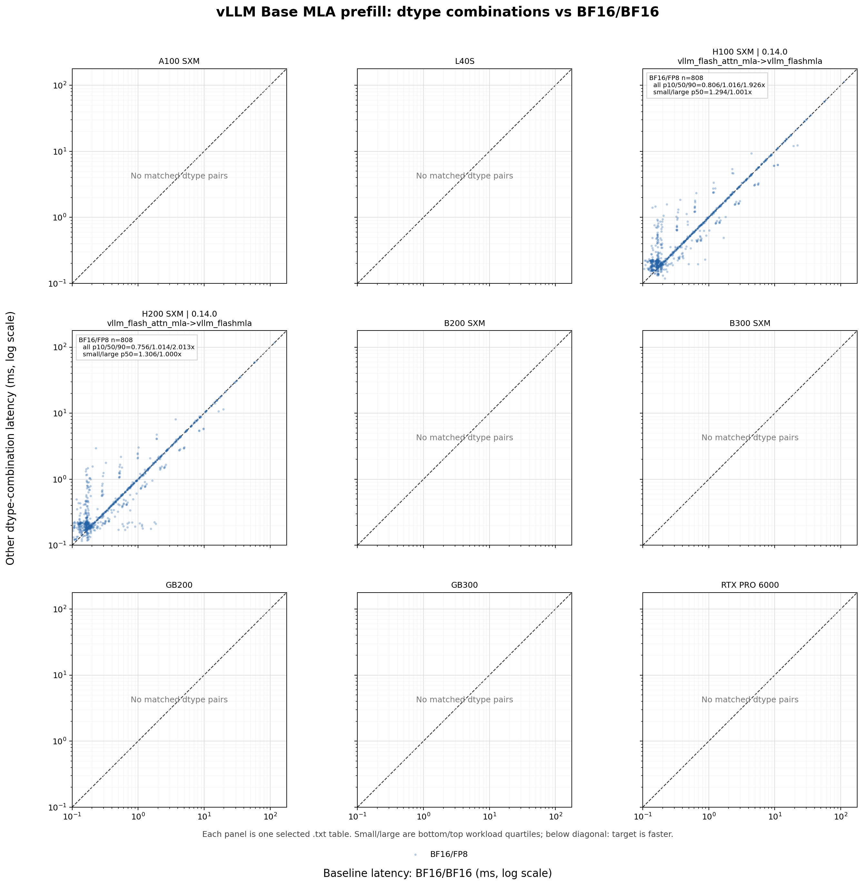

### 4.4 decode × SGLang

| 项目 | 明确结果 |
|---|---|
| collector设计组合 | A100/L40S不采；H100/H200和数据中心Blackwell采BF16/BF16、BF16/FP8；RTX只采BF16/BF16 |
| 数据实存组合 | 与设计一致；H100/H200/四个Blackwell平台有两种，RTX无FP8 |
| 初始输入与计时 | Q、latent K、K-RoPE为BF16，历史cache在timer外预填；当前token量化/rope和Attention在timer内 |

Hopper `flash_attention`与Blackwell `trtllm_mla`方向相反。H100/H200 P10/P50/P90约为1.38/1.78/4.99~6.35，small约1.46而large高达4.45/5.19，算子越大恶化越强。B200/B300/GB200/GB300 P50为0.837~0.854，small约0.97~0.98、large约0.56~0.58，算子越大FP8 cache带宽收益越明显。

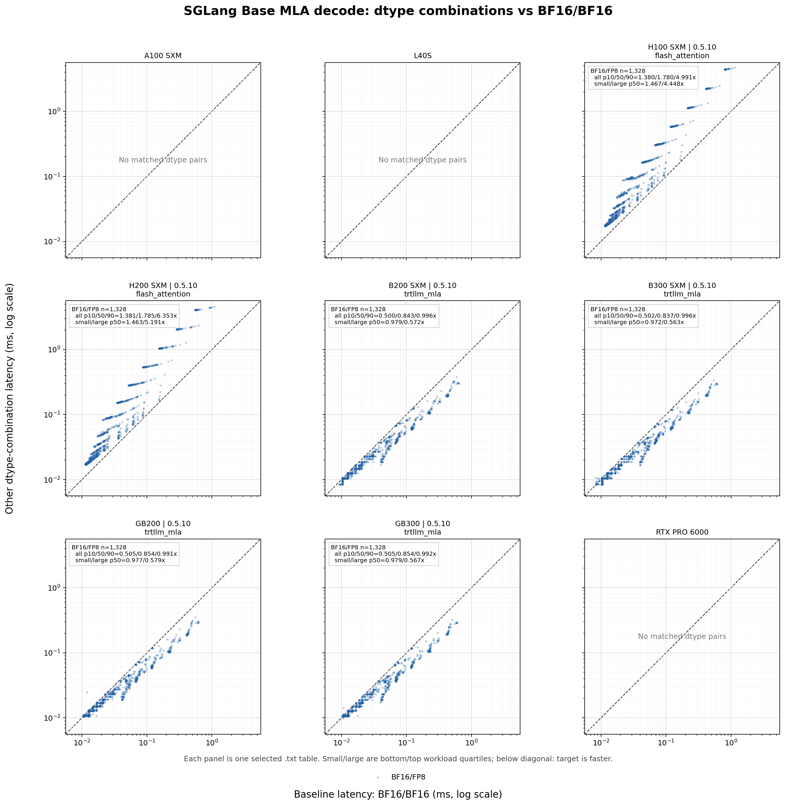

### 4.5 decode × TRT-LLM

| 项目 | 明确结果 |
|---|---|
| v2 collector设计组合 | H100/H200/Blackwell/RTX：BF16/BF16、BF16/FP8 |
| v1 collector设计组合 | A100/L40S只允许BF16/BF16 |
| 数据实存组合 | 九个平台均有两种；A100/L40S FP8仍是异常来源数据 |
| 计时边界 | FP8配置分配quant Q buffer；timed函数先运行`mla_rope_generation()`，再运行Attention `forward()`，量化准备与主干均在timer内 |

排除A100/L40S伪FP8后，所有平台都表现为大算子收益更强。H100/H200 P10/P50/P90为0.560/0.922/1.032和0.734/0.935/1.043；Blackwell P50为0.839~0.857，small约0.91~0.97、large约0.51；RTX为0.541/0.786/1.051，small/large=0.886/0.766。

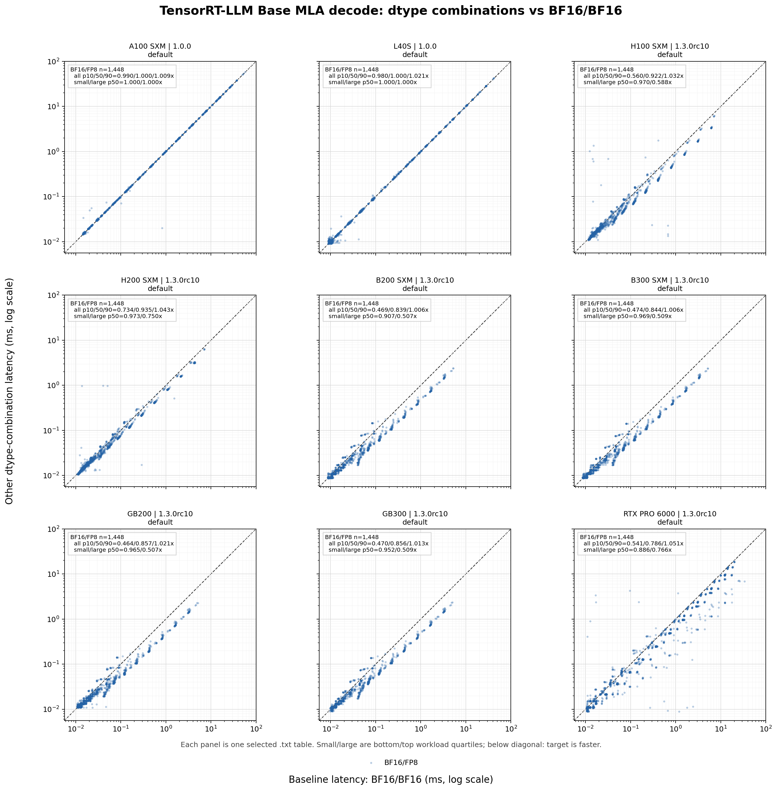

### 4.6 decode × vLLM（历史数据）

| 项目 | 明确结果 |
|---|---|
| collector设计/数据组合 | A100/L40S仅BF16/BF16；H100/H200有BF16/BF16、BF16/FP8 |
| 当前状态 | 仅0.14.0历史基础MLA数据；无当前版本、Blackwell或RTX基础MLA数据 |
| backend变化 | H100/H200由`vllm_flash_attn_mla`切到`vllm_flashmla`，变化率100% |

H100 P10/P50/P90=0.900/1.243/1.593，small 1.298、large 0.962，出现规模反转；H200为0.943/1.284/1.663，small/large=1.292/1.255，大小两端都慢。两者backend都发生变化，不能解释为纯FP8 cache成本。

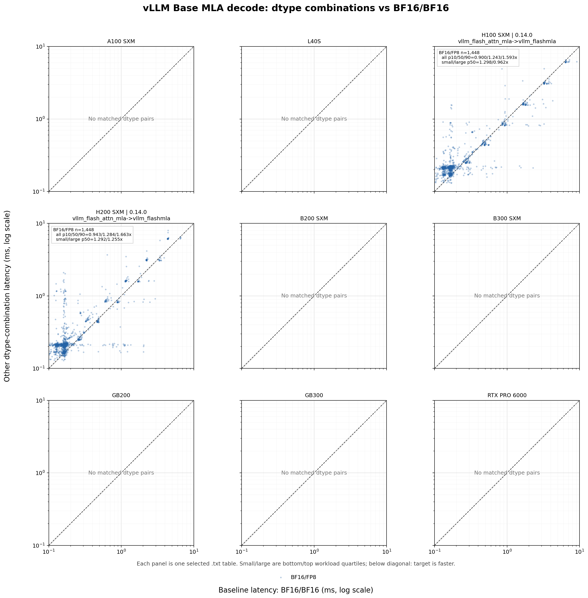

历史vLLM源码实际创建BF16 tensor，却曾把`mla_dtype`和BF16 KV标签写作`float16`，当前系统数据已修正为`bfloat16`，说明中间存在字段修正或后处理，应保留provenance风险标记。

## 5. SDK 查询语义

### 5.1 SILICON loader与查询key

| 算子/stage | SILICON key | dtype字段效力 |
|---|---|---|
| Attention context | `attn_dtype -> kv_cache_dtype -> Hkv -> D -> window -> H -> S -> B` | 两者都生效 |
| Attention generation | `kv_cache_dtype -> Hkv -> D -> window -> H -> B -> total_S` | loader读取`attn_dtype`，但不入key |
| MLA context | `mla_dtype -> kv_cache_dtype -> num_heads -> S -> B` | 两者都生效 |
| MLA generation | `kv_cache_dtype -> num_heads -> B -> total_S` | loader读取`mla_dtype`，但不入key |

`ContextAttention`和`ContextMLA` Operation都向数据库传入compute mode与KV mode；generation Operation只保存KV mode。直接后果是：

- 基础MLA数据只有BF16 `mla_dtype`，context请求FP8 compute时会查不到一级key，而不会自动改走BF16/FP8。
- decode保存的`attn_dtype` / `mla_dtype`是兼容性或provenance字段，不是查询维度。
- 同一字段在context和decode的SDK效力不同，不能统称“Attention dtype”。

### 5.2 SOL/EMPIRICAL中的强假设

当前工作树的`perf_database.py`存在一组并非本文修改的推导：

- `_effective_sglang_fmha_quant_mode()`把BF16 compute + FP8 KV转成FP8有效compute。
- context Attention/MLA的SOL使用该有效mode。
- decode Attention/MLA的SOL直接从KV dtype派生BF16/FP8 compute mode。

风险有三点：

1. helper名为SGLang，却没有检查`self.backend`、hardware或`kernel_source`，会对TRT-LLM/vLLM数据库套用同一规则。RTX Triton、vLLM collector和XQA已证明它不普适。
2. decode没有SILICON compute轴，不代表真实kernel compute必然等于KV dtype，只说明当前数据不能独立识别它。
3. `ContextAttention.query()`额外KV write latency用`_fmha_quant_mode.value.memory`计算K/V写入字节，而非`_kvcache_quant_mode`。若表示最终cache写流量，应使用KV存储dtype；否则变量名与注释需要澄清。

SOL有效dtype规则应限定到`engine + hardware + stage + kernel_source/kernel_variant`，不能只依据两个enum推导。

## 6. 数据面的整体规律

95个“硬件表 × 目标组合”统计项中：

| small/large方向 | 项数 | 含义 |
|---|---:|---|
| 两端都更快 | 48 | target的small和large P50都小于等于1 |
| small更慢、large更快 | 30 | 最常见的规模反转，量化固定成本被大算子摊薄 |
| 两端都更慢 | 15 | target在small和large P50都大于等于1 |
| small更快、large更慢 | 2 | 仅vLLM Hopper Attention prefill出现 |

这组分层结果比单一P50更重要：

1. **FP8 KV不是单调收益。** TRT-LLM Attention decode在L40S P50为1.728、Hopper约0.53；SGLang MLA decode在Hopper大算子升至4.45~5.19倍，Blackwell大算子却降至0.56~0.58倍。
2. **P50会掩盖双向分布。** vLLM L40S Attention prefill P50仅0.924，但P10/P90为0.140/2.072，small/large为1.440/0.261。
3. **字段相同不等于路径相同。** SGLang FP8 `attn_dtype`是timer外FP8输入；TRT-LLM是BF16输入加timed quant config；vLLM根本没有该sweep。
4. **kernel_source不够细。** TRT-LLM只记录`torch_flow/default`，不同架构和规模仍有相反结果；应记录真实C++ kernel family或运行variant。
5. **backend切换必须单独标记。** vLLM L40S/RTX Attention和Hopper MLA的dtype比较发生100% kernel_source变化，只能解释为联合配置变化。
6. **计时边界决定数据意义。** SGLang基础MLA no-prefix prefill不写最终cache；vLLM绕过生产外层Query quant；这些差异不能从dtype标签中恢复。

### 6.1 TRT-LLM 1.0.0 基础 MLA异常数据

A100/L40S的TRT-LLM 1.0.0基础MLA文件同时包含BF16和FP8 KV行，但registry使1.0.0走`collect_mla_v1.py`，而v1执行入口明确断言`kv_cache_dtype == BF16`，保存时也固定写BF16。

| 硬件/stage | 同shape P50 | latency完全相同 | latency在1%内 |
|---|---:|---:|---:|
| A100 prefill | 1.000 | 14.1% | 68.8% |
| A100 decode | 1.000 | 21.3% | 80.7% |
| L40S prefill | 1.000 | 14.8% | 59.5% |
| L40S decode | 1.000 | 19.9% | 66.6% |

这些FP8行与collector能力矛盾，图中保留它们是为了暴露数据质量问题，不用于性能结论。应追溯生成/合并历史并清理伪FP8行，或使用v2重新采集。

## 7. 字段模型与修复优先级

### P0：阻止错误解释

1. 标记并隔离TRT-LLM 1.0.0 A100/L40S基础MLA伪FP8数据。
2. vLLM Attention collector要么经过生产`Attention.forward()`，要么增加`collector_call_level=backend_impl`和`query_quant_included=false`。
3. 修正或澄清`ContextAttention`的KV write byte dtype。

### P1：拆分dtype语义

| 建议字段 | 示例 |
|---|---|
| `input_q_dtype/input_k_dtype/input_v_dtype` | `bfloat16` |
| `kv_storage_dtype` | `fp8_e4m3` |
| `requested_compute_mode` | `fp8` / `auto` |
| `effective_q_kernel_dtype` | `bfloat16` / `fp8` / `mixed` |
| `effective_kv_kernel_dtype` | `fp8` |
| `quantization_scope` | `outside_timer` / `inside_timer` / `fused` / `none` |
| `includes_cache_write` | `true/false` |
| `collector_call_level` | `layer` / `runtime_op` / `backend_impl` |
| `kernel_variant` | `fa3` / `xqa` / `trtllm_gen` / `flashinfer` |

保留旧`attn_dtype` / `mla_dtype`作为兼容字段，但不要再把它们描述成统一的实际算子精度。SILICON compute轴应由真实采集维度决定；decode若要研究Q精度，应新增真实sweep，而不是从KV dtype猜测。

### P2：补profiler证据

每个主要路径至少选择small/medium/large shape各一个做Nsight trace，保存kernel名称序列、量化kernel是否独立、cache write是否融合和timer内字节流。Python调用边界只能确认语义范围，不能最终回答TRT-LLM是否发射“独立量化kernel + Attention主干”两个CUDA算子。

## 8. 最终判定

- 普通Attention prefill：`attn_dtype`是有效控制项，但SGLang和TRT-LLM语义不同，vLLM没有该sweep；decode中它只是保存标签。
- 基础MLA：`mla_dtype`没有sweep、不能控制backend compute，用户关于其“采集侧冗余”的经验基本正确；但context SDK仍把它当查询key，因此“全链路无效”不正确。
- `kv_cache_dtype`：稳定决定cache存储并经常间接决定backend与Q/kernel dtype，但不是跨引擎通用的核心算子精度字段。
- SDK：SILICON与SOL的dtype处理不一致，现有SOL推导过度SGLang化，需要按引擎、硬件、stage和kernel收敛。
- 数据：必须同时看P10/P50/P90、small/large和backend变化；只看P50会漏掉30组“小算子更慢、大算子更快”的规模反转。
