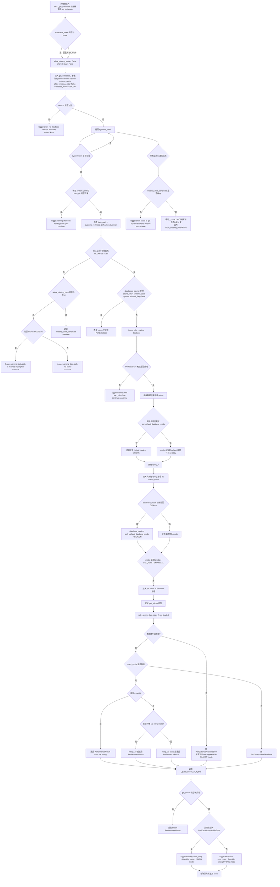
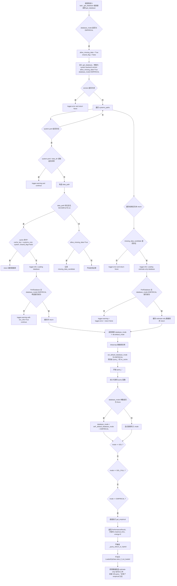
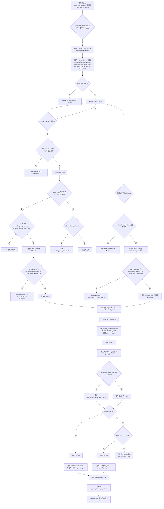
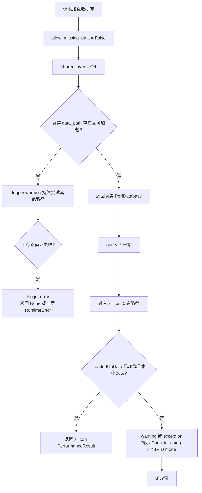
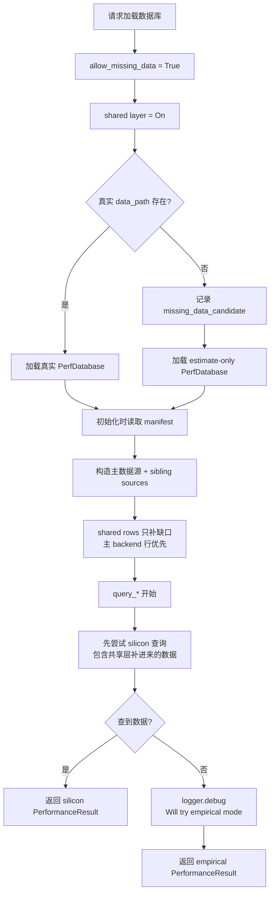
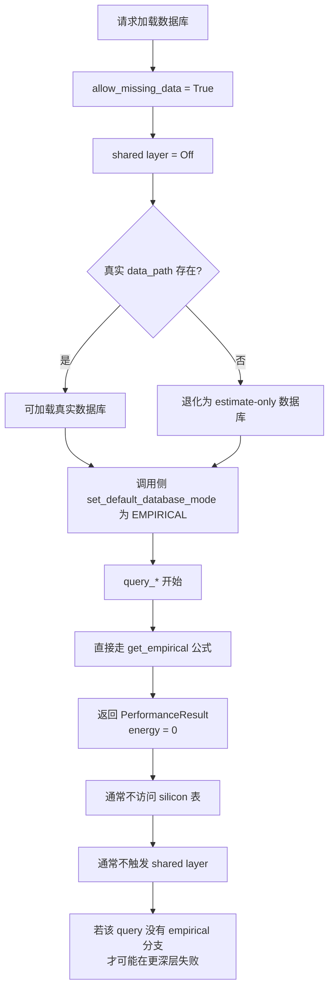
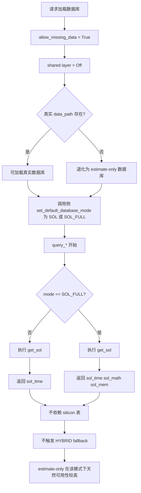

# PerfDatabase 完整流程图总览

本文通过 Mermaid 流程图，系统展示 `src/aiconfigurator/sdk/perf_database.py` 在不同 `database_mode` 下的完整执行逻辑。

目标覆盖两大阶段：

1. **数据库加载阶段**
   从 `get_database()` / `task._get_database()` 开始，直到 `PerfDatabase` 实例建立
2. **query 查询阶段**
   以 `query_gemm()` 这一类典型 `query_*` 实现为代表，展示 mode 分支、fallback、warning 和 error 传播

## 0. 说明与范围

### 0.1 四张图对应的四种主模式

本次按你的要求画四张主图，对应：

- `SILICON`
- `HYBRID`
- `EMPIRICAL`
- `SOL`

需要特别说明的是，源码中的 `DatabaseMode` 实际还有：

- `SOL_FULL`

定义见 [common.py](/home/ai_lab/ljc/scale-up-sim/aiconfigurator/src/aiconfigurator/sdk/common.py:616)。

但由于它本质上是 `SOL` 的“返回更多分解信息”的变体，而不是另一套独立加载逻辑，所以本文把它并入第 4 张 `SOL` 图中，作为一个明确分支画出。

### 0.2 关于“query 查询流程”的忠实还原边界

`PerfDatabase` 里有非常多 `query_*` 函数，不同 op 会有自己的形状处理和局部特判。

但在 `database_mode` 语义上，它们大多数遵循同一骨架：

1. 若 `database_mode is None`，取 `self._default_database_mode`
2. 若为 `SOL` / `SOL_FULL` / `EMPIRICAL`，直接走解析公式
3. 否则进入 `SILICON / HYBRID` 路径
4. 在 `HYBRID` 下，失败时允许 empirical fallback
5. 在 `SILICON` 下，失败则 warning / exception 后抛出

这个模式在 [query_gemm()](/home/ai_lab/ljc/scale-up-sim/aiconfigurator/src/aiconfigurator/sdk/perf_database.py:3923) 中非常典型，因此以下流程图把它作为“代表性 query 骨架”。

---

## 1. `SILICON` 模式流程图

### 1.1 `SILICON` 图解重点

- 加载阶段不允许 `allow_missing_data`，因此目录缺失就是 warning 后继续找，最终可能 `logger.error` 返回 `None`
- `shared_flag=False`，因此不会启用 framework 共享层
- query 阶段不会 fallback 到 empirical
- `raise_if_not_loaded()` 的错误语义最强，明确把当前组合定义为 “not supported in SILICON mode”

---

## 2. `HYBRID` 模式流程图

```mermaid
flowchart TD
    A[调用侧进入 task._get_database 或直接调用 get_database] --> B{database_mode 是否为 HYBRID}
    B -- 是 --> C[allow_missing_data = True<br/>shared_flag = True]
    B -- 否 --> C1[此图仅讨论 HYBRID 主路径]

    C --> D[进入 get_database，参数为 system backend version allow_missing_data=True database_mode=HYBRID]
    D --> E{version 是否为空}
    E -- 是 --> E1[logger.error: No database version available<br/>return None]
    E -- 否 --> F[遍历 systems_paths]

    F --> G{system.yaml 是否存在}
    G -- 否 --> F
    G -- 是 --> H{读取 system.yaml / data_dir 是否异常}
    H -- 是 --> H1[logger.warning: failed to read system spec<br/>continue]
    H -- 否 --> I[构造 data_path]

    I --> J{data_path 存在且无 INCOMPLETE.txt}
    J -- 是 --> K{cache 命中?<br/>cache_key = systems_root, system, shared_flag=True}
    K -- 是 --> K1[return 已缓存 HYBRID-load 数据库]
    K -- 否 --> L[logger.info: Loading database]
    L --> M[构造 PerfDatabase，database_mode=HYBRID]
    M --> N{构造是否成功}
    N -- 否 --> N1[logger.warning with exc_info=True<br/>continue searching]
    N -- 是 --> O[缓存并 return]

    J -- 否 --> P{allow_missing_data=True?}
    P -- 是 --> P1[记录 missing_data_candidate<br/>继续遍历]
    P -- 否 --> P2[不会走到这里]

    F --> Q{遍历结束后仍未 return}
    Q --> R{missing_data_candidate 是否存在}
    R -- 否 --> R1[logger.error: failed to get system backend version<br/>return None]
    R -- 是 --> S[logger.info: Loading estimate-only database]
    S --> T{PerfDatabase 且 database_mode=HYBRID 构造是否成功}
    T -- 否 --> T1[logger.warning: failed to load estimate-only<br/>最终 logger.error + return None]
    T -- 是 --> U[缓存 estimate-only 数据库并 return]

    O --> V[PerfDatabase.__init__]
    U --> V

    V --> W[self.enable_shared_layer = True]
    W --> X[加载 system.yaml -> SystemSpec]
    X --> Y[读取 op_kernel_source_manifest.yaml<br/>缓存为 self._op_kernel_source_manifest_entries]
    Y --> Z[为每个 PerfDataFilename 调用 _load_op_data]
    Z --> ZA[在 _load_op_data 内调用 _build_op_sources]

    ZA --> ZB{enable_shared_layer 是否为 True}
    ZB -- 否 --> ZC[返回 primary_path only]
    ZB -- 是 --> ZD{op 是否为 nccl / oneccl}
    ZD -- 是 --> ZC
    ZD -- 否 --> ZE[从 manifest 读取当前 op_file 可继承的 kernel_source 白名单]

    ZE --> ZF{manifest 是否给当前 backend 开白名单}
    ZF -- 否 --> ZC
    ZF -- 是 --> ZG[构造 per_framework_filter / per_framework_fallback]
    ZG --> ZH[按优先级拼 sources 列表]
    ZH --> ZI[优先级: 主 backend/version -> 同 framework 新版本到旧版本 -> 其他 framework 新版本到旧版本]
    ZI --> ZJ[每个 sibling source 携带 kernel_source_filter]
    ZJ --> ZK{若含 shared_fallback kernel_source}
    ZK -- 是 --> ZL[logger.warning: Loading low-fidelity fallback rows]
    ZK -- 否 --> ZM[继续]

    ZL --> ZN[_read_filtered_rows 按 sources 顺序读取]
    ZM --> ZN
    ZN --> ZO[先到源优先 first-wins<br/>主 backend 行不会被 sibling 覆盖]
    ZO --> ZP[生成 LoadedOpData / supported_quant_mode]

    ZP --> QA[开始 query_*]
    QA --> QB{database_mode 参数是否为 None}
    QB -- 是 --> QC[使用 self._default_database_mode<br/>通常调用侧会 deep copy 后 set 为 HYBRID]
    QB -- 否 --> QD[显式使用 HYBRID]

    QC --> QE{mode 是否为 SOL / SOL_FULL / EMPIRICAL}
    QD --> QE
    QE -- 否 --> QF[进入 SILICON or HYBRID 路径]
    QF --> QG[执行 get_silicon 查询]
    QG --> QH{当前主表 / sibling 共享表中是否查到数据}
    QH -- 是 --> QI[返回 silicon PerformanceResult]
    QH -- 否 --> QJ[抛异常进入 _query_silicon_or_hybrid except]

    QI --> QK[调用 _query_silicon_or_hybrid]
    QJ --> QK
    QK --> QL{get_silicon 是否异常}
    QL -- 否 --> QM[返回 silicon PerformanceResult<br/>source = silicon]
    QL -- 是 --> QN[logger.debug: Will try empirical mode]
    QN --> QO[返回 PerformanceResult，内容为 get_empirical 结果，energy=0，source=empirical]
```

### 2.1 `HYBRID` 图解重点

- 加载阶段就把 `shared_flag=True` 编进缓存键，所以 `HYBRID` 和 `SILICON` 会拿到不同数据库实例
- 共享层发生在 **加载时**，不是 query 时
- query 时仍然先尝试 silicon 数据，只不过这些 silicon 数据现在可能包含 sibling framework/version 继承来的行
- 真正查不到时，`_query_silicon_or_hybrid()` 才 fallback 到 empirical

---

## 3. `EMPIRICAL` 模式流程图

### 3.1 `EMPIRICAL` 图解重点

- `allow_missing_data=True`，因此目录缺失时可以进入 estimate-only
- `shared_flag=False`，所以不会启用 framework 共享层
- query 时通常**直接走经验公式**，不触发 `_query_silicon_or_hybrid()`
- 这也是 estimate-only 在 `EMPIRICAL` 模式下通常最稳的原因

---

## 4. `SOL` 模式流程图（含 `SOL_FULL` 分支）

### 4.1 `SOL` / `SOL_FULL` 图解重点

- 加载阶段与 `EMPIRICAL` 类似，同样允许 estimate-only
- query 时不依赖 silicon 表，而是依赖系统规格和公式
- `SOL_FULL` 与 `SOL` 的关键差别不在加载，而在返回值：
  - `SOL` 返回 `PerformanceResult(sol_time, energy=0)`
  - `SOL_FULL` 返回 `(sol_time, sol_math, sol_mem)`

---

## 5. 四种模式的对照总结

| 模式 | `allow_missing_data` 常见取值 | `shared_flag` | query 主路径 | 查不到 silicon 时行为 |
|---|---|---|---|---|
| `SILICON` | `False` | `False` | 真实数据表 + 插值 | warning / exception 后抛出 |
| `HYBRID` | `True` | `True` | 真实数据表 + 共享层 + 插值 | fallback 到 empirical |
| `EMPIRICAL` | `True` | `False` | 直接经验公式 | 不走 silicon 查询主链 |
| `SOL` | `True` | `False` | 直接 roofline / SOL 公式 | 不走 silicon 查询主链 |

## 6. 最关键的源码设计点

从这四张图里，最值得记住的不是某个小分支，而是以下三点：

1. **加载层和查询层是两层不同语义**
   `shared_flag` / `allow_missing_data` 属于加载层，`DatabaseMode` 分支属于查询层
2. **HYBRID 的增强先发生在加载，再发生在查询**
   先用共享层把可继承的 rows 装进来，再在 query 时做 empirical fallback
3. **estimate-only 不是假装有表，而是允许在缺表前提下继续构造数据库对象**
   真正能不能跑通，取决于该 mode 对 silicon 数据的依赖强不强

## 7. 建议搭配阅读的源码

- [common.py](/home/ai_lab/ljc/scale-up-sim/aiconfigurator/src/aiconfigurator/sdk/common.py:616)
- [perf_database.py](/home/ai_lab/ljc/scale-up-sim/aiconfigurator/src/aiconfigurator/sdk/perf_database.py:320)
- [perf_database.py](/home/ai_lab/ljc/scale-up-sim/aiconfigurator/src/aiconfigurator/sdk/perf_database.py:2515)
- [perf_database.py](/home/ai_lab/ljc/scale-up-sim/aiconfigurator/src/aiconfigurator/sdk/perf_database.py:2604)
- [perf_database.py](/home/ai_lab/ljc/scale-up-sim/aiconfigurator/src/aiconfigurator/sdk/perf_database.py:3482)
- [perf_database.py](/home/ai_lab/ljc/scale-up-sim/aiconfigurator/src/aiconfigurator/sdk/perf_database.py:3849)
- [perf_database.py](/home/ai_lab/ljc/scale-up-sim/aiconfigurator/src/aiconfigurator/sdk/perf_database.py:3923)
- [task.py](/home/ai_lab/ljc/scale-up-sim/aiconfigurator/src/aiconfigurator/sdk/task.py:1230)

---

## 8. 四种 Mode 精简版流程图

下面四张图不是源码逐分支复刻，而是提炼每种 mode 最关键的控制逻辑。

保留的重点只有四类：

- 数据库加载时是否允许缺表
- 是否启用 shared layer
- query 主路径走 silicon 还是公式
- 最终返回、warning、error 的关键出口

### 8.1 `SILICON` 精简版

### 8.2 `HYBRID` 精简版

### 8.3 `EMPIRICAL` 精简版

### 8.4 `SOL` 精简版

### 8.5 四种精简图的理解重点

- `SILICON` 的关键词是：真实数据优先，缺表即失败，不做经验兜底。
- `HYBRID` 的关键词是：共享层补数据，查不到再经验回退。
- `EMPIRICAL` 的关键词是：直接经验公式，数据库更多只是系统规格载体。
- `SOL` 的关键词是：直接 roofline/SOL 公式，`SOL_FULL` 只是返回更细分解。
